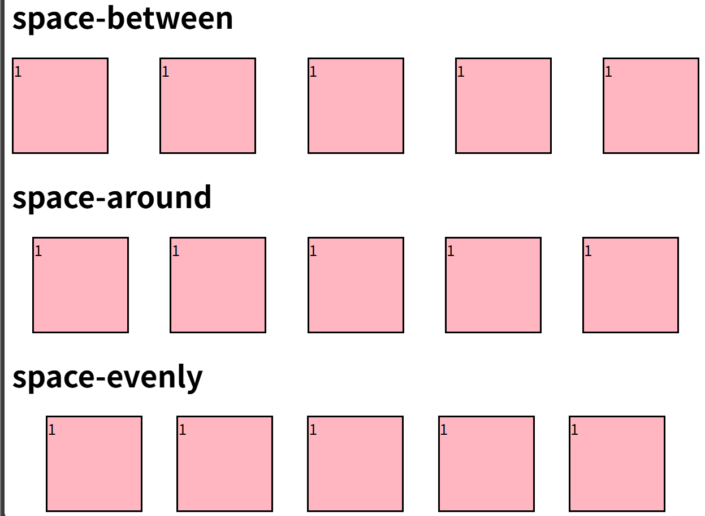
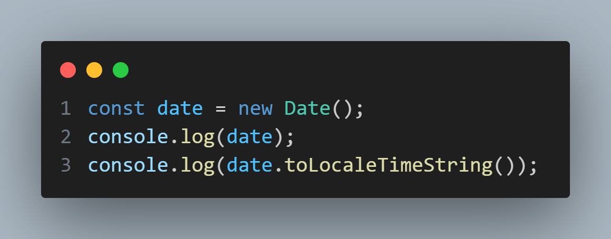

#   📅 前端学习

前端基础，掌握 HTML、CSS、JavaScript，熟练使用 Vue3 进行项目开发。

---

## 🛠️ 学习资源
- **HTML & CSS**: [MDN 文档](https://developer.mozilla.org/zh-CN/docs/Web)
- **JavaScript**: [JavaScript 高级程序设计](https://book.douban.com/subject/10546125/)
- **Vue3**: [Vue 官方文档](https://cn.vuejs.org/)
- **实战项目**: [Vue3 开源项目示例](https://github.com/vuejs/awesome-vue)

# 另外补充零碎知识点

**CSS自定义属性**` --custom_properties`


# HTML 基础（标签、属性、结构）

[HTML 教程 | 菜鸟教程](https://www.runoob.com/html/html-tutorial.html)

## HTML基本结构

```html
<!DOCTYPE html> 
<html lang="en">

<head>
    <meta charset="UTF-8">
    <meta name="viewport" content="width=device-width, initial-scale=1.0">
    <title>Document</title>
</head>

<body>
    <!-- 页面内容 -->
</body>
</html>

```

**DOCTYPE**是HTML5中一种标准通用标记语言的文档类型声明，它的目的是**告诉浏览器（解析器）应该以什么样（html或xhtml）的文档类型定义**来解析文档**

`<base>`标签位于head内部，是一个 **HTML 空元素（Void Element）**，它用于为文档中的所有**相对 URL**（Relative URLs）指定一个**基准 URL（Base URL）**。

简单来说，它定义了页面中所有链接、图片、脚本等资源引用的**默认起点**。
一个html文档只能有一个base标签

## HTML属性

属性是 HTML 元素提供的附加信息。

属性通常出现在 HTML 标签的开始标签中，用于定义元素的行为、样式、内容或其他特性。

属性总是以 **name="value"** 的形式写在标签内，**name** 是属性的名称，**value** 是属性的值。

<a>标签的`target`属性用于指定链接的打开方式，默认为`self`即当前窗口

### **自定义属性**

在 HTML 里，`data-` 属性是一种自定义属性，用于在 HTML 元素上存储私有数据，方便 JavaScript 访问。下面详细介绍 `data-` 属性：

**基本语法**

`data-` 属性的命名需遵循一定规则，以 `data-` 开头，后面接自定义名称，名称只能包含字母、数字、连字符、点、冒号和下划线，且不能包含大写字母。示例如下：

```html
<div id="example" data-user-id="123" data-user-name="John Doe"></div>
```

**作用**

- **存储数据**：可在 HTML 元素上存储额外信息，无需修改 DOM 结构或使用全局变量。
- **增强语义**：能让 HTML 代码更具语义，表明元素和数据间的关联。
- **方便交互**：便于 JavaScript 操作和处理元素数据，实现动态交互。

#### 在 JavaScript 中访问 `data-` 属性

在 JavaScript 里，可以使用 `dataset` 属性访问 `data-` 属性。`dataset` 是一个对象，包含元素所有 `data-` 属性，属性名会去掉 `data-` 前缀，且将连字符连接的单词转换为驼峰命名。示例如下：

```html
<!DOCTYPE html>
<html lang="zh-CN">
<head>
    <meta charset="UTF-8">
    <meta name="viewport" content="width=device-width, initial-scale=1.0">
    <title>Data 属性示例</title>
</head>
<body>
    <div id="example" data-user-id="123" data-user-name="John Doe"></div>
    <script>
        const element = document.getElementById('example');
        // 访问 data-user-id 属性
        const userId = element.dataset.userId;
        // 访问 data-user-name 属性
        const userName = element.dataset.userName;

        console.log(`用户 ID: ${userId}`); 
        console.log(`用户姓名: ${userName}`); 
    </script>
</body>
</html>
```

**修改 `data-` 属性**

在 JavaScript 中，也能通过 `dataset` 属性修改 `data-` 属性的值，示例如下：

```html
<!DOCTYPE html>
<html lang="zh-CN">
<head>
    <meta charset="UTF-8">
    <meta name="viewport" content="width=device-width, initial-scale=1.0">
    <title>修改 Data 属性示例</title>
</head>
<body>
    <div id="example" data-user-id="123" data-user-name="John Doe"></div>
    <script>
        const element = document.getElementById('example');
        // 修改 data-user-id 属性
        element.dataset.userId = '456';
        // 修改 data-user-name 属性
        element.dataset.userName = 'Jane Smith';

        console.log(`新用户 ID: ${element.dataset.userId}`); 
        console.log(`新用户姓名: ${element.dataset.userName}`); 
    </script>
</body>
</html>
```

**注意事项**

- **兼容性**：`dataset` 属性在现代浏览器中得到广泛支持，但在旧版浏览器（如 IE 10 及以下）中可能存在兼容性问题。若需兼容旧版浏览器，可使用 `getAttribute` 和 `setAttribute` 方法。
- **性能**：频繁读写 `data-` 属性可能影响性能，特别是在处理大量元素时，应谨慎使用。

## HTML标签

### 嵌套规则

行内元素可以嵌套在块级元素内，但块级元素不能嵌套在行内元素内。

### **行内元素（Inline elements）**：

- 这些元素不会占据整行，而是与其他元素在同一行显示。常见的行内元素有：

  - `<span>`、`<a>`、`<strong>`、`<em>`、`<b>` 、``、`<input>` 、`<select>`、`<i>`   等。
    
  - em（emphais强调语义，会影响句子意义）斜体
    
  - i 不强调内容 ，表述另一种语态/语调/情绪 斜体
    
  - b 不强调内容重要性，仅用于引起读者注意 粗体 更推荐使用css
    
  - strong （强调重要性,紧急性 会影响**SEO**）粗体
    
    
  
    | 标签           | 视觉效果 | 核心语义                       | 选择时问自己：                         |
    | -------------- | -------- | ------------------------------ | -------------------------------------- |
    | **`<strong>`** | 粗体     | **重要性**或**紧急性**         | 内容对读者或程序来说是否**至关重要**？ |
    | **`<b>`**      | 粗体     | **引起注意**（无重要性）       | 我只是想让这个词**在视觉上突出**吗？   |
    | **`<em>`**     | 斜体     | **强调**（改变语调或含义）     | 我是否想**在口头上强调**这个词？       |
    | **`<i>`**      | 斜体     | **另一种语态**（如外语、想法） | 这个词是另一种**语言或文本类型**吗？   |
    
    
    
    
### 块级元素（Block-level elements）：

  - 这些元素会占据整行，并且通常用于结构化布局。常见的块级元素有：

  - `<div>`、`<p>`、`<h1>`、`<ul>`、`<ol>`、`<li>`、`<dl>`、`<dt>`、`<dd>` 等。
  - **`<div>`** 是块级标签（Block-level element），它会占据整行，通常用于布局和容器。例如，你可以用它来包裹一段内容或其他元素。块级元素通常会在页面上从新的一行开始显示。
    `<div>`与`<p>`区别是,`<p>`会默认在段前和断后留有额外的空间


  例子： 

  ```html
  <div>
      <h1>标题</h1>
      <p>这是一段内容。</p>
  </div>
  ```

- **`<span>`** 是行内标签（Inline element），它不会单独占用一行，而是与其他元素在同一行显示。通常用于对文本进行样式修改或者包裹小范围的内容。

  例子：

  ```html
  <p>这是一个 <span style="color: red;">红色</span> 字段。</p>
  ```

总结：

- `<div>`：块级元素，占满一整行，可以包含块级和行内元素。
- `<span>`：行内元素，只占用它的内容的宽度，不会换行。

1. `<dl>` (Description List)

- **作用**：作为**整个描述列表的容器**。它告诉浏览器，它内部包含了一组术语和它们的描述。


2. `<dt>` (Definition Term)

- **作用**：用于**定义术语或名称**。它位于 `<dl>` 内部，通常后面会紧跟着一个或多个 `<dd>` 标签。
- **特点**：一个 `<dt>` 可以有多个 `<dd>`。


3. `<dd>` (Definition Description)

- **作用**：用于**描述或定义**紧邻在它前面的那个 `<dt>` 标签中的术语。
- **特点**：一个 `<dt>` 后面可以跟多个 `<dd>`，这意味着一个术语可以有多个描述或定义。


```html
<dl>
  <dt>HTML</dt>
  <dd>超文本标记语言 (HyperText Markup Language)，用于创建网页结构。</dd>

  <dt>CSS</dt>
  <dd>层叠样式表 (Cascading Style Sheets)，用于控制网页的外观和样式。</dd>
  <dd>定义了字体、颜色、布局等视觉属性。</dd>
</dl>
```

适用场景

- **术语表**：列出专业术语及其定义。

- **元数据**：显示文章的作者、发布日期、分类等键值对信息。

- **问答对**：列出问题（`<dt>`）和答案（`<dd>`）。

  

### 空元素

即没有内容的HTML元素。空元素是在开始标签中关闭的，也就是空元素没有闭合标签：

- 常见的有：`<br>`、`<hr>`、``、`<input>`、`<link>`、`<meta>`；
- 鲜见的有：`<area>`、`<base>`、`<col>`、`<colgroup>`、`<command>`、`<embed>`、`<keygen>`、`<param>`、`<source>`、`<track>`、`<wbr>`。


| 标签             | 描述                                      | 常见用途                                                     |
| ---------------- | ----------------------------------------- | ------------------------------------------------------------ |
| **`<area>`**     | **图像映射区域** (Image Map Area)         | 定义一个图像地图（Image Map）中的可点击区域。                |
| **`<base>`**     | **基准 URL** (Base URL)                   | 定义页面中所有相对 URL 的**基准路径**。所有相对链接都会以此标签定义的 URL 为起点。 |
| **`<col>`**      | **表格列** (Column)                       | 用于为表格中的一列或多列应用样式或属性，必须位于 `<colgroup>` 内部。 |
| **`<colgroup>`** | **表格列组** (Column Group)               | 定义表格中一组列的集合，通常与 `<col>` 配合使用。            |
| **`<embed>`**    | **嵌入外部内容** (Embed)                  | 用于嵌入外部应用程序或交互式内容（如 Flash、PDF 或第三方媒体播放器）。 |
| **`<param>`**    | **参数** (Parameter)                      | 用于为 `<object>` 标签中嵌入的对象设置运行时参数。           |
| **`<source>`**   | **媒体资源源** (Source)                   | 为 `<audio>`、`<video>` 或 `<picture>` 标签指定多个媒体资源文件。浏览器会选择最适合的那个加载。 |
| **`<track>`**    | **媒体轨道** (Track)                      | 为 `<audio>` 或 `<video>` 元素添加定时文本轨道，比如字幕或标题。 |
| **`<wbr>`**      | **可选的换行符** (Word Break Opportunity) | 建议浏览器在必要时可以在此位置进行换行，通常用于很长的词或 URL，以防止溢出。 |

### `<meta>`标签

`meta` 标签由 `name` 和 `content` 属性定义，**用来描述网页文档的属性**，比如网页的作者，网页描述，关键词等，除了HTTP标准固定了一些`name`作为大家使用的共识，开发者还可以自定义name。

常用的meta标签：

（1）`charset`，用来描述HTML文档的编码类型：

```html
<meta charset="UTF-8" >
```

（2） `keywords`，页面关键词：

```html
<meta name="keywords" content="关键词" />
```

（3）`description`，页面描述：

```html
<meta name="description" content="页面描述内容" />
```

（4）`refresh`，页面重定向和刷新：

```html
<meta http-equiv="refresh" content="0;url=" />  //隔多少秒，跳转到url

```

（5）`viewport`，适配移动端，可以控制视口的大小和比例：

```html
<meta name="viewport" content="width=device-width, initial-scale=1, maximum-scale=1">
```

其中，`content` 参数有以下几种：

- `width viewport` ：宽度(数值/device-width)
- `height viewport` ：高度(数值/device-height)
- `initial-scale` ：初始缩放比例
- `maximum-scale` ：最大缩放比例
- `minimum-scale` ：最小缩放比例
- `user-scalable` ：是否允许用户缩放(yes/no）

（6）搜索引擎索引方式：

```html
<meta name="robots" content="index,follow" />
```

其中，`content` 参数有以下几种：

- `all`：文件将被检索，且页面上的链接可以被查询；
- `none`：文件将不被检索，且页面上的链接不可以被查询；
- `index`：文件将被检索；
- `follow`：页面上的链接可以被查询；
- `noindex`：文件将不被检索；
- `nofollow`：页面上的链接不可以被查询。

## HTML表格
`<table>` 是用来显示表格数据的。常用在数据排版、成绩单、价格列表这种地方。

### **基本结构**：

```html
<table>
    <caption>表格总标题</caption>
  <thead>
    <tr>
      <th>标题1</th>
      <th>标题2</th>
    </tr>
  </thead>
  <tbody>
    <tr>
      <td>单元格1</td>
      <td>单元格2</td>
    </tr>
    <tr>
      <td>单元格3</td>
      <td>单元格4</td>
    </tr>
  </tbody>
</table>
```

---

### 主要标签解释

| 标签 | 作用 |
| :--- | :--- |
| `<table>` | 表格的开始和结束 |
| `<thead>` | 表头部分（可选，提升可读性） |
| `<tbody>` | 表体部分（可选，一般是数据区） |
| `<tfoot>` | 表尾部分（比如总结，页脚） |
| `<tr>` | 表格的一行 (table row) |
| `<th>` | 表头单元格 (table header)，加粗居中，默认是标题 |
| `<td>` | 表格单元格 (table data)，装数据 |
| `<caption>` | 为表格添加标题 |

---

### 其他属性

| 属性 | 作用 |
| :--- | :--- |
| `border` | 设置表格边框（不过推荐用CSS） |
| `cellspacing` | 设置单元格之间的间距 |
| `cellpadding` | 设置单元格内部的填充（内边距） |
| `colspan` | 合并**列**（跨列） |
| `rowspan` | 合并**行**（跨行） |
| `width`、`height` | 设置宽高（可以用CSS控制） |
| `scope` | `scope` 是 `<th>` 标签的一个属性，它用于明确表头单元格与表格中数据单元格之间的关联范围 |

---

 例子：合并单元格

```html
<table border="1">
  <tr>
    <th>姓名</th>
    <th colspan="2">联系方式</th>
  </tr>
  <tr>
    <td>小可爱</td>
    <td>12345678</td>
    <td>email@example.com</td>
  </tr>
  <tr>
    <td rowspan="2">超人</td>
    <td>87654321</td>
    <td>super@example.com</td>
  </tr>
  <tr>
    <td>00001111</td>
    <td>superman@example.com</td>
  </tr>
</table>
```

- `colspan="2"` 表示一个单元格横跨两列。
- `rowspan="2"` 表示一个单元格竖着占两行。

---

**注意**

- `<thead>` `<tbody>` `<tfoot>` 不是必须的，但是能让表格更语义化、层次更清楚。
- 表格样式推荐用 **CSS** 调整，比如加上边框、控制间距、美化字体。
- 现代网页尽量少用表格布局页面，只用来展示**纯数据**！

---


# HTML5新增 

## HTML语义化

### 1. 什么是HTML 语义化？

HTML 语义化指的是使用具有 **明确含义** 的标签，而不是单纯的 `<div>` 或 `<span>`，使得代码更具**可读性**、可访问性和 **SEO** 友好性,方便开发和维护,更适合搜索引擎的**爬虫**。

例如，使用 `<header>` 而不是 `<div class="header">`，让浏览器和开发者都能清楚这个部分是 **网页的头部**。

------

### **2. 常见的语义化标签**

| 语义化标签     | 作用                                       |
| -------------- | ------------------------------------------ |
| `<header>`     | 定义网页的头部，通常包含 logo、导航等      |
| `<nav>`        | 表示导航栏，包含网站主要链接               |
| `<main>`       | 页面主要内容，每个页面仅有一个 `<main>`    |
| `<section>`    | 表示一个独立的内容区域，通常有标题         |
| `<article>`    | 表示一篇独立的文章，如博客、新闻           |
| `<aside>`      | 侧边栏，通常放额外信息（广告、推荐文章等） |
| `<footer>`     | 页脚，通常包含版权信息、联系方式等         |
| `<figure>`     | 用于包裹图像、图表、代码块等               |
| `<figcaption>` | `figure` 内的标题或描述                    |
| `<mark>`       | 让文本高亮显示，表示重要信息               |
| `<time>`       | 定义时间，可以被搜索引擎识别               |

------

### **3. 语义化 HTML 代码示例**

```html
<!DOCTYPE html>
<html lang="zh">
<head>
    <meta charset="UTF-8">
    <meta name="viewport" content="width=device-width, initial-scale=1.0">
    <title>HTML 语义化示例</title>
</head>
<body>

    <header>
        <h1>我的网站</h1>
        <nav>
            <ul>
                <li><a href="#">首页</a></li>
                <li><a href="#">关于</a></li>
                <li><a href="#">联系</a></li>
            </ul>
        </nav>
    </header>

    <main>
        <section>
            <h2>最新文章</h2>
            <article>
                <h3>HTML 语义化的好处</h3>
                <p>使用语义化 HTML 有助于 SEO，并提高代码可读性。</p>
                <figure>
                    
                    <figcaption>HTML 语义化示例</figcaption>
                </figure>
            </article>
        </section>
    </main>

    <aside>
        <h2>推荐阅读</h2>
        <ul>
            <li><a href="#">CSS 语义化</a></li>
            <li><a href="#">JavaScript 最佳实践</a></li>
        </ul>
    </aside>

    <footer>
        <p>&copy; 2025 我的博客. All rights reserved.</p>
    </footer>

</body>
</html>
```

------

### 4. 为什么要使用语义化 HTML？

 ✅ 可读性更强：开发者可以更直观地理解代码结构。
 ✅ 有助于 SEO：搜索引擎可以更准确地索引网页内容，提高排名。
 ✅ 可访问性增强：屏幕阅读器可以更好地解析内容，方便残障用户浏览。
 ✅ 更容易维护：代码结构清晰，便于修改和扩展。

## 媒体标签

（1） audio：音频


```html<audio src='' controls autoplay loop='true'></audio>```

属性：

controls 控制面板

autoplay 自动播放

loop=‘true’ 循环播放


（2）video视频


```html<video src='' poster='imgs/aa.jpg' controls></video>```

属性：

poster：指定视频还没有完全下载完毕，或者用户还没有点击播放前显示的封面。默认显示当前视频文件的第一针画面，当然通过poster也可以自己指定。

controls 控制面板

width

height


（3）source标签

因为浏览器对视频格式支持程度不一样，为了能够兼容不同的浏览器，可以通过source来指定视频源。


```html<video>

 	<source src='aa.flv' type='video/flv'></source>

 	<source src='aa.mp4' type='video/mp4'></source>

</video>```

# HTML表单

### 常见的HTML表单标签和控件：

1. **`<input>`**：用于创建各种类型的输入控件。根据 `type` 属性的不同，`<input>` 可以变成不同的表单控件，例如文本框、复选框、单选按钮等。

   ```html
   <input type="text" name="username"> <!-- 文本输入框 -->
   <input type="password" name="password"> <!-- 密码输入框 -->
   <input type="radio" name="gender" value="male"> <!-- 单选按钮  具有相同name的选项只能选择一个-->  
   <input type="checkbox" name="subscribe" value="yes"> <!-- 复选框 -->
   <input type="submit" value="提交"> <!-- 提交按钮 -->
   <input type="range" min="1" max="10" name="iterations"> <!-- 滑块按钮 -->
   <input type="number" min="1" max="100" value="50" name="precision"><!--限制输入为数字，有上下的小箭头调整数值。-->
```

   **自动补全输入框（`<input list="...">` + `<datalist>`）**

   用户输入时，浏览器根据你设置的建议列表，自动弹出下拉选项

   ```html
   <input list="something" name="yourinput">
   <datalist id="something">
     <option value="建议1">
     <option value="建议2">
     <option value="建议3">
   </datalist>
   ```

   ### 自动补全和下拉菜单的区别？

   | 特性     | 自动补全（input + datalist） | 下拉菜单（select） |
   | -------- | ---------------------------- | ------------------ |
   | 自己输入 | 可以                         | 不可以             |
   | 只能选？ | 不限                         | 必须从选项中选     |
   | 外观     | 输入框，打字就出现建议       | 下拉列表框         |
   | 用途     | 搜索框、智能建议、灵活输入   | 固定选项选择       |

2. **`<label>`**：为表单控件提供标签，用于描述该控件的功能。通过 `for` 属性，可以将 `<label>` 与特定的表单控件绑定。

   ```html
   <label for="username">用户名：</label>
   <input type="text" id="username" name="username">
   ```

   这样，当用户点击 "用户名：" 标签时，光标会自动跳到对应的输入框。

3. **`<select>`**：创建下拉列表，允许用户选择一个或多个选项。

   ```html
   <select name="country">
     <option value="china">中国</option>
     <option value="usa">美国</option>
     <option value="japan">日本</option>
   </select>
   ```

4. **`<textarea>`**：用于创建多行文本输入框，常用于让用户输入较长的文本。

   ```html
   <textarea name="message" rows="4" cols="50">请输入您的留言</textarea>
   ```

5. **`<button>`**：创建按钮，常用于提交表单或执行其他操作。

   ```html
   <button type="submit">提交</button>
   ```

6. **`<form>`**：定义一个表单，包含了所有的输入控件和提交按钮。

   ```html
   <form action="/submit_form" method="post">
     <label for="username">用户名：</label>
     <input type="text" id="username" name="username">
     <input type="submit" value="提交">
   </form>
   ```

`placeholder` 占位符属性，显示提示文本

**`name`**：主要用于**表单数据的提交**，是服务器端识别和处理数据的依据。一个表单中的多个元素可以有相同的 `name`（比如单选按钮组），但一个 `name` 通常只对应一个 `textarea`。

## 表单

### **表单类型**：

- email ：能够验证当前输入的邮箱地址是否合法
- url ： 验证URL
- number ： 只能输入数字，其他输入不了，而且自带上下增大减小箭头，max属性可以设置为最大值，min可以设置为最小值，value为默认值。
- search ： 输入框后面会给提供一个小叉，可以删除输入的内容，更加人性化。
- range ： 可以提供给一个范围，其中可以设置max和min以及value，其中value属性可以设置为默认值
- color ： 提供了一个颜色拾取器
- time ： 时分秒
- date ： 日期选择年月日
- datatime ： 时间和日期(目前只有Safari支持)
- datatime-local ：日期时间控件
- week ：周控件
- month：月控件


### **表单属性：**

- placeholder ：提示信息
- autofocus ：自动获取焦点
- autocomplete=“on” 或者 autocomplete=“off” 使用这个属性需要有两个前提：

- 表单必须提交过
- 必须有name属性。

- required：要求输入框不能为空，必须有值才能够提交。
- pattern=" " 里面写入想要的正则模式，例如手机号patte="^(+86)?\d{10}$"
- multiple：可以选择多个文件或者多个邮箱
- form=" form表单的ID"


### **表单事件：**

- oninput 每当input里的输入框内容发生变化都会触发此事件。
- oninvalid 当验证不通过时触发此事件。

### 进度条、度量器

- progress标签：用来表示任务的进度（IE、Safari不支持），max用来表示任务的进度，value表示已完成多少
- meter属性：用来显示剩余容量或剩余库存（IE、Safari不支持）

- high/low：规定被视作高/低的范围
- max/min：规定最大/小值
- value：规定当前度量值


设置规则：min < low < high < max

## 表单验证

[表单数据校验 - 学习 Web 开发 | MDN](https://developer.mozilla.org/zh-CN/docs/Learn_web_development/Extensions/Forms/Form_validation)

### HTML5 内置表单验证

HTML5 提供了一些内置验证功能，例如：

- **`required`**：必填字段。
- **`minlength` 和 `maxlength`**：字符最小/最大长度。
- **`pattern`**：使用正则表达式匹配输入内容。
- **`type`**：例如 `email`（自动验证邮箱格式）、`number`（只能输入数字）、`url`（只能输入网址）。
- **`min` 和 `max`**：用于数字输入的最小/最大值。

**示例：**

```html
<input type="text" name="username" required minlength="4" maxlength="16">
<input type="email" name="email" required>
<input type="password" name="password" required pattern=".{6,}" title="密码至少 6 个字符">
```

------

### JavaScript 自定义验证

HTML5 内置验证只能处理基础需求，复杂验证（如密码强度、两次密码匹配等）需要 JavaScript。

（1）**实时验证输入**

```html
<input type="text" id="username" required>
<p id="username-error" style="color: red; display: none;">用户名至少 4 个字符</p>

<script>
    document.getElementById("username").addEventListener("input", function () {
        let username = this.value;
        let errorMsg = document.getElementById("username-error");
        
        if (username.length < 4) {
            errorMsg.style.display = "block";
        } else {
            errorMsg.style.display = "none";
        }
    });
</script>
```

（2）**提交前检查表单**

```html
<form id="registerForm">
    <input type="password" id="password" placeholder="密码" required>
    <input type="password" id="confirmPassword" placeholder="确认密码" required>
    <p id="error-message" style="color: red; display: none;">两次密码不一致！</p>
    <button type="submit">提交</button>
</form>

<script>
    document.getElementById("registerForm").addEventListener("submit", function (event) {
        let password = document.getElementById("password").value;
        let confirmPassword = document.getElementById("confirmPassword").value;
        let errorMsg = document.getElementById("error-message");

        if (password !== confirmPassword) {
            errorMsg.style.display = "block";
            event.preventDefault(); // 阻止表单提交
        } else {
            errorMsg.style.display = "none";
        }
    });
</script>
```


## DOM查询操作

- document.querySelector()
- document.querySelectorAll()

它们选择的对象可以是标签，可以是类(需要加点)，可以是ID(需要加#)

## Web存储

HTML5 提供了两种在客户端存储数据的新方法：

- localStorage - 没有时间限制的数据存储
- sessionStorage - 针对一个 session 的数据存储

| 特性         | `sessionStorage`                       | `localStorage`                           |
| ------------ | -------------------------------------- | ---------------------------------------- |
| **生命周期** | 标签页/窗口关闭时清除                  | 永久存储，除非手动清除                   |
| **可访问性** | 不跨标签页                             | 跨标签页、跨窗口                         |
| **用途**     | 存储临时数据，如表单草稿、用户会话信息 | 存储长期数据，如用户偏好设置、购物车内容 |

`sessionStorage` 对象提供了几个简单的方法来操作数据：

- **`setItem(key, value)`**：存储数据，键和值都必须是字符串。

  

  ```javascript
  sessionStorage.setItem('username', 'Alice');
  ```

- **`getItem(key)`**：根据键获取数据。

  

  ```javascript
  const user = sessionStorage.getItem('username'); // 'Alice'
  ```

- **`removeItem(key)`**：删除指定键的数据。

  

  ```javascript
  sessionStorage.removeItem('username');
  ```

- **`clear()`**：清除所有存储的数据。

  

  ```javascript
  sessionStorage.clear();
  ```

- **`length`**：获取存储的键值对数量。

  

  ```javascript
  const count = sessionStorage.length;
  ```

## 其他

- 拖放：拖放是一种常见的特性，即抓取对象以后拖到另一个位置。设置元素可拖放：

```html

```

- 画布（canvas ）： canvas 元素使用 JavaScript 在网页上绘制图像。画布是一个矩形区域，可以控制其每一像素。canvas 拥有多种绘制路径、矩形、圆形、字符以及添加图像的方法。

```html
<canvas id="myCanvas" width="200" height="100"></canvas>
```

- SVG：SVG 指可伸缩矢量图形，用于定义用于网络的基于矢量的图形，使用 XML 格式定义图形，图像在放大或改变尺寸的情况下其图形质量不会有损失，它是万维网联盟的标准
- 地理定位：Geolocation（地理定位）用于定位用户的位置。‘

# 补充

## src和href区别

```javascript
<script src =”js.js”></script>
<link href=”common.css” rel=”stylesheet”/>
```

**src 用于替换当前元素，href 用于在当前文档和引用资源之间确立联系。**

**src:浏览器会暂停其他资源的下载和处理,优先处理完src资源**
**href:浏览器会并行下载资源不会停止对当前文档的处理**

## script标签中defer和async的区别

**defer 和 async属性都是去异步加载外部的JS脚本文件，它们都不会阻塞页面的解析**，其区别如下：

- **执行顺序：**多个带async属性的标签，不能保证加载的顺序；多个带defer属性的标签，按照加载顺序执行；
- **脚本是否并行执行**：async属性，表示**后续文档的加载和执行与js脚本的加载和执行是并行进行的**，即异步执行；defer属性，加载后续文档的过程和js脚本的加载(此时仅加载不执行)是并行进行的(异步)，js脚本需要等到文档所有元素解析完成之后才执行，DOMContentLoaded事件触发执行之前。
- 

好的，下面是关于 **Web Worker** 的介绍。

------


## Web Worker

**Web Worker** 是一种 HTML5 技术，它允许 JavaScript 脚本在**后台线程**中运行，而不会阻塞或干扰浏览器的主线程。

在传统的浏览器环境中，JavaScript 运行在单线程的**主线程**中，这个主线程负责处理所有用户界面（UI）更新、事件处理和 DOM 操作。如果在这个主线程中运行耗时的任务（如复杂的计算、大量数据处理），页面就会出现卡顿、无响应（俗称“假死”），用户体验极差。

Web Worker 就是用来解决这个问题的。它将那些耗时的计算任务交给一个独立的工作线程去处理。

------


### 关键特点


1. **独立线程 (Separate Thread)**


Worker 在一个完全独立于主线程的后台线程中运行。这意味着它可以执行大量的、计算密集型的任务，而不会影响到页面的流畅度和响应速度。


2. **无法访问 DOM (No DOM Access)**


Worker 线程不能直接操作 DOM 元素，也不能访问许多浏览器 API（如 `window` 对象）。这是因为 DOM 并非线程安全，如果多个线程同时修改 DOM 结构，会造成混乱。


3. **通过消息机制通信 (Message Passing)**


主线程和 Worker 线程之间通过 **消息机制（`postMessage()` 和 `onmessage`）**进行通信。

- **主线程**使用 `worker.postMessage(data)` 向 Worker 发送数据。
- **Worker 线程**使用 `self.postMessage(result)` 将结果返回给主线程。
- **主线程**通过监听 `worker.onmessage` 事件来接收 Worker 返回的数据。


4. **生命周期**


Worker 线程的生命周期是独立的：

- **创建**：通过 `new Worker('worker.js')` 创建。
- **终止**：可以通过 `worker.terminate()` (主线程) 或 `self.close()` (Worker 内部) 随时终止。一旦终止，Worker 线程就会被释放。

------

### 种类


目前主要有两种 Web Worker：

| Worker 类型                        | 描述                                                   | 适用场景                                                     |
| ---------------------------------- | ------------------------------------------------------ | ------------------------------------------------------------ |
| **Dedicated Worker** (专用 Worker) | 最常用。只能被创建它的主页面（或脚本）使用和访问。     | 复杂的数学计算、图像处理、加密解密等一次性任务。             |
| **Shared Worker** (共享 Worker)    | 可以被**同源**的不同浏览器窗口、标签页或 Iframe 访问。 | 跨标签页共享数据和任务（例如：保持一个持久的 WebSocket 连接）。 |

------


### 适用场景

Web Worker 最适合以下场景：

- **大数据处理**：对大量 JSON 数据进行排序、筛选或处理。
- **复杂算法**：如加密/解密、复杂物理模拟、AI/机器学习模型的本地计算。
- **预加载/预取**：在后台下载或处理用户可能需要的资源，然后缓存起来，等待主线程调用。
- **定时任务**：需要精确计时且不被页面卡顿影响的定时器。

通过使用 Web Worker，可以确保即使运行最复杂的脚本，网页界面也能保持流畅、响应迅速。

##  HTML5的离线储存

离线存储指的是：在用户没有与因特网连接时，可以正常访问站点或应用，在用户与因特网连接时，更新用户机器上的缓存文件。

appcache已被弃用

下面是关于 **Service Worker** 的详细介绍，它被认为是现代 Web 开发中最重要的技术之一，是构建高性能、可靠和**渐进式 Web 应用 (PWA)** 的核心。

###  Service Worker？

Service Worker 是一个用 JavaScript 编写的**脚本**，它在**浏览器后台独立运行**，充当浏览器和网络之间的**可编程代理（Programmable Proxy）**。

它能拦截并处理所有由网页发出的网络请求，这赋予了开发者前所未有的控制权，包括：

1. **离线支持**：使用缓存API，允许用户在完全没有网络连接时也能访问应用。
2. **性能优化**：通过缓存常用资源，加快网站的加载速度。
3. **高级功能**：实现推送通知（Push Notifications）和后台同步（Background Sync）。

------


**Service Worker 的关键特性**

1. 独立于主线程

Service Worker 运行在一个完全独立的线程中，与网页的主 JavaScript 线程（负责 UI 和 DOM）是分开的。这意味着它**不会阻塞页面渲染**，可以执行复杂的后台任务。

2. 生命周期

Service Worker 有一个定义明确的生命周期，它不是一直运行的，只有在需要时才会被激活（例如，有网络请求需要拦截时）。

- **安装 (Installing)**：浏览器第一次下载并安装 Worker 脚本。
- **激活 (Activating)**：Worker 安装成功后，被激活并可以开始工作。
- **空闲 (Idle)**：一段时间后，如果 Worker 没有工作，浏览器会将其终止以节省资源。
- **更新**：如果 Worker 脚本文件内容发生变化，浏览器会启动新的 Worker 进行更新，直到新的 Worker 接管旧 Worker 的所有控制权。

3. 事件驱动

Service Worker 主要通过监听事件来工作，最关键的事件有：

- **`install` 事件**：通常用于设置缓存（预先缓存应用程序的核心资源）。
- **`activate` 事件**：Worker 准备就绪，可以开始控制页面。
- **`fetch` 事件**：**核心事件**。每次网页发起网络请求时都会触发，Worker 在这里可以拦截请求，决定是返回缓存中的响应还是继续向网络发起请求。

4. 无法直接访问 DOM

与 Web Worker 类似，Service Worker 也不能直接访问 DOM，因为它运行在后台。它通过 **`postMessage()`** 方法与受其控制的页面进行通信。

------


**Service Worker 的主要优势 (为什么使用它？)**

| 优势         | 描述                                                         |
| ------------ | ------------------------------------------------------------ |
| **离线体验** | 开发者可以控制 `fetch` 事件，实现“**网络优先**”或“**缓存优先**”的策略，确保应用在离线时也能加载。 |
| **可靠性**   | 解决了 AppCache 的更新困境，Service Worker 的更新流程更加清晰可靠。 |
| **推送通知** | 即使应用或浏览器处于关闭状态，Service Worker 也可以接收服务器推送的消息，并向用户显示通知。 |
| **后台同步** | 允许应用在用户处于离线状态时收集数据，并在用户重新上线时自动同步到服务器。 |


Service Worker 是现代 Web 应用从“网站”迈向“应用”的关键技术。它提供了对网络请求的**完全控制**，是实现 PWA 的离线功能、缓存策略和原生应用式体验（如推送通知）的**基础设施**。

## iframe——嵌入第三方服务

`<iframe>`（即 Inline Frame，内联框架）是一个 HTML 元素，它允许你、将另一个 HTML 文档嵌入到当前 HTML 文档中。

将 `<iframe>` 想象成当前网页中的一个“小窗口”，这个窗口里显示的内容完全来自另一个独立的 URL，并且这个外部内容与你当前页面的内容是隔离的。

| 属性              | 作用                                                         | 示例                                           |
| ----------------- | ------------------------------------------------------------ | ---------------------------------------------- |
| **`src`**         | **必需属性**。指定要嵌入的文档的 URL。                       | `src="https://example.com/external-page.html"` |
| **`width`**       | 指定框架的宽度（像素或百分比）。                             | `width="800"` 或 `width="100%"`                |
| **`height`**      | 指定框架的高度（像素或百分比）。                             | `height="600"`                                 |
| **`frameborder`** | *（已废弃）* 用于指定是否显示框架边框。在 HTML5 中应使用 CSS `border` 属性代替。 | `frameborder="0"`                              |
| **`allow`**       | 用于启用或禁用嵌入内容中某些功能（如全屏、支付、地理定位）。 | `allow="fullscreen; payment"`                  |
| **`sandbox`**     | **重要安全属性**。用于限制嵌入内容的行为，防止恶意代码执行。 | `sandbox="allow-scripts allow-forms"`          |

## HTML5 Drag API

HTML5 拖放 API 允许用户通过鼠标（或触摸）将一个元素从一个位置拖动到另一个位置，并释放（放下）它。它是通过一系列 **JavaScript 事件**和 **HTML 属性**共同协作来实现的。


### 核心组件


1. **`draggable` 属性（开关）**
   - **作用**：设置在 HTML 元素上，用来激活拖放功能。
   - **用法**：`draggable="true"`。
2. **`dataTransfer` 对象（数据载体）**
   - **作用**：在拖动过程中传输数据（如元素的 ID 或 URL）。
   - **关键方法**：
     - `event.dataTransfer.setData(format, data)`：在 `dragstart` 中设置数据。
     - `event.dataTransfer.getData(format)`：在 `drop` 中获取数据。

------


### 关键事件流程


拖放过程由五个核心事件驱动，分别发生在**可拖动元素（Source）**和**放置目标（Target）**上：


#### 1. 可拖动元素事件 (Source)


| 事件            | 发生时机                           | 关键作用                                              |
| --------------- | ---------------------------------- | ----------------------------------------------------- |
| **`dragstart`** | 用户开始拖动时触发。               | **设置数据**：使用 `setData()` 存储要移动的元素信息。 |
| **`dragend`**   | 拖动完成（成功放下或取消）时触发。 | 清理样式或执行最终逻辑。                              |


#### 2. 放置目标事件 (Target)


| 事件            | 发生时机                                 | 关键作用                                                     |
| --------------- | ---------------------------------------- | ------------------------------------------------------------ |
| **`dragover`**  | 被拖动元素悬停在目标上方时**持续触发**。 | **激活放置**：**必须调用 `event.preventDefault()`**，这是允许元素放置的关键一步。 |
| **`dragenter`** | 被拖动元素进入放置目标区域时触发。       | 提供视觉反馈（如改变边框颜色）。                             |
| **`drop`**      | 用户在目标区域释放鼠标时触发。           | **处理逻辑**：使用 `getData()` 获取数据，执行移动、复制或链接等操作。 |


`draggable="true"` 仅仅是启动拖动视觉效果的开关。真正的功能实现依赖于 JavaScript 对事件的监听，特别是：

1. 在 **`dragstart`** 中打包数据。
2. 在 **`dragover`** 中调用 `event.preventDefault()` 允许放置。
3. 在 **`drop`** 中执行最终的 DOM 操作。

# **CSS 基础（选择器、优先级、文本样式）**

CSS（Cascading Style Sheets，层叠样式表）用于控制网页的外观。你可以使用 CSS 设置 **颜色、字体、布局** 等样式。今天我们重点学习 **选择器、优先级、文本样式**。

------

## **1️⃣ CSS 选择器**

选择器用于 **选中 HTML 元素** 并应用样式。常见选择器有以下几种：

### **基础选择器**

| 选择器           | 作用           | 示例                                    |
| ---------------- | -------------- | --------------------------------------- |
| **元素选择器**   | 选择 HTML 标签 | `p { color: red; }` （所有 `<p>` 变红） |
| **类选择器**     | 选择 class     | `.btn { background: blue; }`            |
| **ID 选择器**    | 选择 id        | `#header { font-size: 20px; }`          |
| **通配符选择器** | 选择所有元素   | `* { margin: 0; }`                      |

在HTML和CSS中，**一个标签的 `class` 属性可以有多个值**。在HTML里，为元素的 `class` 属性赋值时，若要指定多个类名，需使用**空格**把各个类名分隔开来。

------

### **组合选择器**

| 选择器                      | 作用                | 示例                        |
| --------------------------- | ------------------- | --------------------------- |
| **后代选择器（A B）**       | 选择 A 内的所有 B   | `div p { color: red; }`     |
| **子代选择器（A > B）**     | 选择 A 直接子元素 B | `div > p { color: blue; }`  |
| **相邻兄弟选择器（A + B）** | 选择紧邻 A 之后的 B | `h1 + p { color: green; }`  |
| **通用兄弟选择器（A ~ B）** | 选择 A 之后的所有 B | `h1 ~ p { color: purple; }` |
| **选中多个**                | 选择A，B...         | `h1 + h2 {color:blue;}`     |

------

###  属性选择器

| 选择器            | 作用                          | 示例                                            |
| ----------------- | ----------------------------- | ----------------------------------------------- |
| `[attr]`          | 选择有某属性的元素            | `[disabled] { color: gray; }`                   |
| `[attr="value"]`  | 选择属性值等于 value 的元素   | `input[type="text"] { border: 1px solid red; }` |
| `[attr^="value"]` | 选择属性值以 value 开头的元素 | `a[href^="https"] { color: blue; }`             |
| `[attr$="value"]` | 选择属性值以 value 结尾的元素 | `a[href$=".pdf"] { color: green; }`             |
| `[attr*="value"]` | 选择属性值包含 value 的元素   | `p[class*="important"] { font-weight: bold; }`  |

**示例：**

```css
/* 选择所有禁用的输入框 */
input[disabled] {
  background: lightgray;
}

/* 选择所有文本输入框 */
input[type="text"] {
  border: 1px solid black;
}
```

------
### 伪元素选择器
伪元素选择器允许你给 HTML 元素的特定部分添加样式，比如文字的第一个字母、第一行，或者在元素前后插入内容。

常见的伪元素有这些：

|伪元素选择器	|作用|
|---------------------|-----------------------------------------------|
|::before	|在元素内部的 内容前面 插入内容|
|::after	|在元素内部的 内容后面 插入内容|
|::first-letter|	选中块级元素中第一行的第一个字母|
|::first-line|	选中块级元素中的第一行文字|
|::selection|	用户高亮文本时，被选中的部分|

✏️ 举例解释
1. ::before 和 ::after
在元素前后添加内容（配合 content 属性使用）：

```css
p::before {
  content: "🌸";
  color: pink;
}

p::after {
  content: "🌸";
  color: pink;
}
```


::before：在段落 p 前加个花。
::after：在段落 p 后加个花。

👉 注意：content 必须设置，不然啥也不会出现！

2. ::first-letter
选中文本的第一个字母，给它加样式：

```css
p::first-letter {
  font-size: 2em;
  color: red;
}
```

比如段落第一个字母变大变红，很常见在杂志、小说排版里。

3. ::first-line
选中文本的第一行：

```css
p::first-line {
  color: blue;
  font-weight: bold;
}
```

只让第一行变色加粗哦，不影响后面的文字。

4. ::selection
选中一段文字时改变高亮样式：

```css
p::selection {
  background-color: black;
  color: white;
}
```

当你鼠标拖选文字时，高亮的颜色就变成了黑底白字！

🌟 小总结
::before 和 ::after → 在元素前后加内容
::first-letter → 第一个字母
::first-line → 第一行
::selection → 选中文字的样式

### 伪类选择器

伪类选择器（Pseudo-classes）是 CSS 选择器的一种，它允许你根据元素的**特定状态**、**在 DOM 树中的位置**，或者其他**不基于元素名称或属性**的特点来选中元素，并为其应用样式。

简单来说，伪类选择器能够选中那些**动态的、或在结构上具有特殊性**的元素。

伪类选择器的特点是使用一个**冒号** (`:`) 开头。

------

#### 1. 动态/用户行为伪类 (User Action Pseudo-classes)


这类伪类用于匹配元素在用户交互时的状态，通常用于提升用户体验。

| 伪类           | 描述                                                | 示例                                    |
| -------------- | --------------------------------------------------- | --------------------------------------- |
| **`:hover`**   | 当用户**鼠标悬停**在元素上时。                      | `a:hover { color: red; }`               |
| **`:active`**  | 当元素被**激活**（如鼠标按下或被点击）时。          | `button:active { background: darken; }` |
| **`:focus`**   | 当元素**获取焦点**（如通过 Tab 键或点击输入框）时。 | `input:focus { border-color: blue; }`   |
| **`:link`**    | 匹配**未被访问过**的链接。                          | `a:link { color: blue; }`               |
| **`:visited`** | 匹配**已被访问过**的链接。                          | `a:visited { color: purple; }`          |

------


#### 2. 结构性伪类 (Structural Pseudo-classes)


这类伪类基于元素在父元素中的**位置或顺序**来选择元素，而不需要为它们添加额外的类或 ID。

| 伪类                  | 描述                                                         | 示例                                                         |
| --------------------- | ------------------------------------------------------------ | ------------------------------------------------------------ |
| **`:first-child`**    | 匹配作为其父元素**第一个子元素**的元素。                     | `li:first-child { font-weight: bold; }`                      |
| **`:last-child`**     | 匹配作为其父元素**最后一个子元素**的元素。                   | `p:last-child { margin-bottom: 0; }`                         |
| **`:nth-child(n)`**   | 匹配作为其父元素**第 n 个子元素**的元素。`n` 可以是数字、关键词（`odd`/`even`）或公式。 | `li:nth-child(2n) { background: #eee; }` (选中偶数行)        |
| **`:nth-of-type(n)`** | 匹配作为**同类型兄弟元素**中的第 n 个元素。                  | `p:nth-of-type(3) { color: green; }` (选中第三个 `<p>` 标签) |
| **`:only-child`**     | 匹配作为其父元素的**唯一**子元素的元素。                     | `span:only-child { font-size: 1.2em; }`                      |

------


#### 3. 目标与状态伪类 (Target and State Pseudo-classes)


这类伪类用于匹配元素在文档或表单中的特定状态。

| 伪类                 | 描述                                                         | 示例                                         |
| -------------------- | ------------------------------------------------------------ | -------------------------------------------- |
| **`:target`**        | 匹配当前 URL 的 **Fragment（片段标识符，#后面的内容）**所指向的元素。 | `#section:target { border: 2px solid red; }` |
| **`:checked`**       | 匹配处于**选中状态**的单选按钮或复选框。                     | `input:checked + label { color: green; }`    |
| **`:disabled`**      | 匹配处于**禁用状态**的表单元素。                             | `input:disabled { opacity: 0.5; }`           |
| **`:not(selector)`** | **否定伪类**。匹配**不符合**括号内选择器的元素。             | `div:not(.header) { margin-top: 20px; }`     |


### **伪元素和伪类的区别和作用？**

- 伪元素：在内容元素的前后插入额外的元素或样式，但是这些元素实际上并不在文档中生成。它们只在外部显示可见，但不会在文档的源代码中找到它们，因此，称为“伪”元素。例如：

```css
p::before {content:"第一章：";}
p::after {content:"Hot!";}
p::first-line {background:red;}
p::first-letter {font-size:30px;}
```

- 伪类：将特殊的效果添加到特定选择器上。它是已有元素上添加类别的，不会产生新的元素。例如：

```css
a:hover {color: #FF00FF}
p:first-child {color: red}
```

**总结：**伪类是通过在元素选择器上加⼊伪类改变元素状态，⽽伪元素通过对元素的操作进⾏对元素的改变。 

------

## **2️⃣ CSS 优先级（权重计算）**

当多个规则作用于同一个元素时，浏览器按照 **优先级** 选择应用哪个规则。

###  规则

**权重计算规则：**

带有`!important`的声明具有**最高**的优先级

1. **内联样式（`style=""`）** `1000`
2. **ID 选择器（`#id`）** `100`
3. **类、伪类、属性选择器（`.class`、`:hover`、`[attr]`）** `10`
4. **元素选择器、伪元素选择器（`div`、`h1`、`p` 、`::before`）** `1`
5. **通配符 `\*`、继承样式** `0`
6. **组合选择器，其权重为它所包含的标签，id，类的权重求和**

**示例：**

```css
h1 { color: blue; }        /* 权重 1 */
#title { color: red; }     /* 权重 100 */
.title { color: green; }   /* 权重 10 */
```

如果 `h1` 既有 `#title` 也有 `.title`，最终应用 **红色（ID 选择器）**。

💡 

- **尽量避免使用 ID 选择器**，用 **类选择器** 代替。（方便CSS代码复用，方便样式覆盖）

- **不要滥用 `!important`**，否则很难修改样式。（破坏层叠性）

  

### 区分：HTML 属性 vs. CSS 内联样式

  这里的核心是看样式信息是通过哪个**机制**传递给浏览器的：

  | 机制             | 示例                                         | 角色与优先级                                                 |
  | ---------------- | -------------------------------------------- | ------------------------------------------------------------ |
  | **HTML 属性**    | ``             | 它们是 **呈现提示（Presentational Hints）** 或浏览器的**默认样式**。它们的优先级**低于**所有 CSS 规则（无论是外部、内部还是内联 CSS）。 |
  | **CSS 内联样式** | `` | 它们是真正的 **CSS 规则**。在 CSS 优先级计算中，它们具有最高的权重 **(1, 0, 0, 0)**，会覆盖所有外部或内部的样式规则。 |

------

## **3️⃣ 文本样式**

### **🔹 字体**

| CSS 属性         | 作用       | 示例                              |
| ---------------- | ---------- | --------------------------------- |
| `font-size`      | 字体大小   | `font-size: 16px;`                |
| `font-family`    | 字体       | `font-family: Arial, sans-serif;` |
| `font-weight`    | 字体粗细   | `font-weight: bold;`              |
| `font-style`     | 斜体       | `font-style: italic;`             |
| `text-transform` | 文字大小写 | `text-transform: uppercase;`      |

**示例：**

```css
p {
  font-size: 18px;
  font-family: "Arial", sans-serif;
  font-weight: bold;
}
```

------

**🔹 文本对齐**

| CSS 属性      | 作用     | 示例                  |
| ------------- | -------- | --------------------- |
| `text-align`  | 文本对齐 | `text-align: center;` |
| `text-indent` | 首行缩进 | `text-indent: 20px;`  |
| `line-height` | 行高     | `line-height: 1.5;`   |

**示例：**

```css
p {
  text-align: justify;
  text-indent: 20px;
  line-height: 1.6;
}
```

------

### **🔹 文本修饰**

| CSS 属性          | 作用             | 示例                          |
| ----------------- | ---------------- | ----------------------------- |
| `text-decoration` | 下划线、删除线等 | `text-decoration: underline;` |
| `letter-spacing`  | 字母间距         | `letter-spacing: 2px;`        |
| `word-spacing`    | 单词间距         | `word-spacing: 5px;`          |

**示例：**

```css
a {
  text-decoration: none;
}
```

------

### **🔹 颜色**

| CSS 属性           | 作用     | 示例                        |
| ------------------ | -------- | --------------------------- |
| `color`            | 文字颜色 | `color: red;`               |
| `background-color` | 背景颜色 | `background-color: yellow;` |

**示例：**

```css
h1 {
  color: #ff5733;
  background-color: black;
}
```


# CSS中可继承与不可继承属性有哪些

## **一、无继承性的属性**

1. **display**：规定元素应该生成的框的类型
2. **文本属性**：

- vertical-align：垂直文本对齐
- text-decoration：规定添加到文本的装饰
- text-shadow：文本阴影效果
- white-space：空白符(换行，空格，制表符)的处理
- unicode-bidi：设置文本的方向

1. **盒子模型的属性**：width、height、margin、border、padding

2. **背景属性**：background、background-color、background-image、background-repeat、background-position、background-attachment（元素的背景图像是**固定**在视口（viewport）中，还是**随着元素内容滚动**。）

3. **定位属性**：

   float（让元素脱离正常的文档流，并沿着其父容器的左侧或右侧移动，直到遇到父容器的边缘或另一个浮动元素。常用于实现文字环绕图片或多列布局。）

   clear（用于阻止元素被之前的浮动元素所影响。通常应用于浮动元素后面的元素，确保它从新的行开始。最常用的值是 `both`。）

   position、top、right、bottom、left、min-width、min-height、max-width、max-height、overflow、clip、z-index

4. **生成内容属性**：content、counter-reset、counter-increment

   

   ------

   

   ## 1. `content`

   

   `content` 属性是**生成内容**的启动开关和主要载体。它定义了要插入到伪元素中的实际内容。

   | 属性          | 作用                   | 关键点                                                       |
   | ------------- | ---------------------- | ------------------------------------------------------------ |
   | **`content`** | **定义要插入的内容。** | **必须**与伪元素（`::before` 或 `::after`）一起使用。如果伪元素中缺少 `content` 属性，它将不会显示。 |

   

   | 值         | 描述                         | 示例                         |
   | ---------- | ---------------------------- | ---------------------------- |
   | **字符串** | 插入普通文本。               | `content: "Read More »";`    |
   | **URL**    | 插入图片（作为装饰）。       | `content: url('icon.svg');`  |
   | **计数器** | 插入自动生成的编号。         | `content: counter(section);` |
   | **属性值** | 插入被选中元素的某个属性值。 | `content: attr(data-icon);`  |
   | **`none`** | 不插入任何内容（默认值）。   | `content: none;`             |

   好的，`content`、`counter-reset` 和 `counter-increment` 是 CSS 中用于**生成内容（Generated Content）**的三个核心属性，它们通常与**伪元素（`::before` 和 `::after`）**配合使用，用于在文档中插入不属于 HTML 结构的装饰性或编号内容。

   ------

   

   ## 1. `content`

   

   `content` 属性是**生成内容**的启动开关和主要载体。它定义了要插入到伪元素中的实际内容。

   | 属性          | 作用                   | 关键点                                                       |
   | ------------- | ---------------------- | ------------------------------------------------------------ |
   | **`content`** | **定义要插入的内容。** | **必须**与伪元素（`::before` 或 `::after`）一起使用。如果伪元素中缺少 `content` 属性，它将不会显示。 |

   Export to Sheets

   

   ### `content` 的常用值

   

   | 值         | 描述                         | 示例                         |
   | ---------- | ---------------------------- | ---------------------------- |
   | **字符串** | 插入普通文本。               | `content: "Read More »";`    |
   | **URL**    | 插入图片（作为装饰）。       | `content: url('icon.svg');`  |
   | **计数器** | 插入自动生成的编号。         | `content: counter(section);` |
   | **属性值** | 插入被选中元素的某个属性值。 | `content: attr(data-icon);`  |
   | **`none`** | 不插入任何内容（默认值）。   | `content: none;`             |

   

   ## 2. `counter-reset`

   `counter-reset` 属性用于**创建或重置**一个或多个 CSS 计数器。

   ## 3. `counter-increment`

   `counter-increment` 属性用于**增加或减少**一个或多个 CSS 计数器的值。

   ----

   

5. **轮廓样式属性**：outline-style、outline-width、outline-color、outline （轮廓（Outline）是绘制在元素**边框（Border）外围**的一圈线条，主要用于**可访问性（Accessibility）和用户焦点提示**。它不会占用布局空间，因此不会影响元素的尺寸或位置。）

6. **页面样式属性**：size、page-break-before、page-break-after

7. **声音样式属性**：pause-before、pause-after、pause、cue-before、cue-after、cue、play-during


## **二、有继承性的属性**

1. **字体系列属性**

- font-family：字体系列
- font-weight：字体的粗细
- font-size：字体的大小
- font-style：字体的风格

1. **文本系列属性**

- text-indent：文本缩进
- text-align：文本水平对齐
- line-height：行高
- word-spacing：单词之间的间距
- letter-spacing：中文或者字母之间的间距
- text-transform：控制文本大小写（就是uppercase、lowercase、capitalize这三个）
- color：文本颜色

1. **元素可见性**

- visibility：控制元素显示隐藏

1. **列表布局属性**

- list-style：列表风格，包括list-style-type、list-style-image等

1. **光标属性**

- cursor：光标显示为何种形态

# 布局


## **1️⃣ 盒模型（Box Model）**

每个 HTML 元素在浏览器中都被当作一个 **矩形盒子**，其结构如下：


盒模型由 **四个部分** 组成（从内到外）：

1. **内容（content）**：元素的实际内容区域，如文本、图片等。
2. **内边距（padding）**：围绕内容的空间，增加填充效果。
3. **边框（border）**：包裹内容和内边距的边界。
4. **外边距（margin）**：元素与其他元素之间的距离。

### **🔹 盒模型相关属性**

| CSS 属性           | 作用             | 示例                           |
| ------------------ | ---------------- | ------------------------------ |
| `width` / `height` | 盒子的宽度和高度 | `width: 200px; height: 100px;` |
| `padding`          | 内边距           | `padding: 10px;`               |
| `border`           | 边框             | `border: 2px solid black;`     |
| `margin`           | 外边距           | `margin: 20px;`                |
| `box-sizing`       | 盒模型计算方式   | `box-sizing: border-box;`      |

**示例：**

```css
.box {
  width: 200px;
  height: 100px;
  padding: 10px;
  border: 2px solid blue;
  margin: 20px;
  box-sizing: border-box; /* 让宽高包含 padding 和 border */
}
```

**`width` 属性只限制了容器本身的宽度，但不会自动限制其内部内容的溢出**。需要额外的 CSS 规则来控制文本的换行行为。最常用的有：

- `word-break: break-all;`：在任何字符处强制换行。

- `overflow-wrap: break-word;`：在长单词或 URL 处换行。


-----

📌 **`box-sizing: border-box;`** 能确保 `width` 和 `height` 包含 `padding` 和 `border`，避免盒子尺寸超出预期。

`box-sizing` 是 CSS 的一个属性，控制元素的宽高计算方式。默认情况下，**元素的 `width` 和 `height` 只包含内容 (`content`)，但不包含 `padding` 和 `border`**，这有时会导致盒子尺寸超出预期。因此，我们可以使用 `box-sizing: border-box;` 来改变计算方式。

------

#### **1️⃣ `box-sizing` 的两种模式**

| 值                    | 说明                                                         | 计算方式                                       |
| --------------------- | ------------------------------------------------------------ | ---------------------------------------------- |
| `content-box`（默认） | `width` 和 `height` 只计算 `content`，不包括 `padding` 和 `border` | `总宽度 = content（width） + padding + border` |
| `border-box`          | `width` 和 `height` **包含** `content`、`padding` 和 `border` | `总宽度 = width（包含所有）`                   |

------

#### **2️⃣ `content-box`（默认模式）**

在 `content-box` 模式下：

- `width` 和 `height` **只包含内容**，**不包含 `padding` 和 `border`**。
- 盒子的**实际大小** = `width` + `padding` + `border`。

##### **🌟 示例**

```css
.box {
  width: 200px;
  height: 100px;
  padding: 20px;
  border: 10px solid black;
  box-sizing: content-box;
}
```

📌 **计算实际大小**

- `内容宽度`: 200px
- `左右 padding`: 20px × 2 = **40px**
- `左右 border`: 10px × 2 = **20px**
- **最终盒子宽度**: **200 + 40 + 20 = 260px**
- `内容高度`: 100px
- `上下 padding`: 20px × 2 = **40px**
- `上下 border`: 10px × 2 = **20px**
- **最终盒子高度**: **100 + 40 + 20 = 160px**

❌ **问题：`width` 设定 200px，但最终盒子实际变大到 260px！**

------

#### **3️⃣ `border-box`（推荐模式）**

在 `border-box` 模式下：

- **`width` 和 `height` 包括 `content`、`padding` 和 `border`**。
- 盒子的**实际大小固定为 `width`**，不会因为 `padding` 和 `border` 变大。

##### **🌟 示例**

```css
.box {
  width: 200px;
  height: 100px;
  padding: 20px;
  border: 10px solid black;
  box-sizing: border-box;
}
```

📌 **计算实际大小**

- `盒子总宽度`: 200px（固定，不会变大）
- `内容宽度`: **200 - (20px × 2) - (10px × 2) = 140px**
- `盒子总高度`: 100px（固定）

✅ **优点**

- `width` 仍然是 200px，不会因 `padding` 和 `border` 变大。
- 适用于 **响应式布局**，不会让盒子尺寸超出预期。

------

#### **4️⃣ `border-box` 的最佳实践**

💡 在现代开发中，通常会 **全局启用 `border-box`**，避免盒子因 `padding` 和 `border` 撑大：

```css
* {
  box-sizing: border-box;
}
```

这样所有元素的 `width` 都是 **包含 `padding` 和 `border` 的总大小**，布局更可控。

------

#### **5️⃣ `border-box` VS `content-box` 对比**

| 模式          | `width: 200px; padding: 20px; border: 10px solid;`       | 实际宽度  |
| ------------- | -------------------------------------------------------- | --------- |
| `content-box` | 只算 `content`，最终 **200 + 40 + 20 = 260px**           | **260px** |
| `border-box`  | `width` 包含 `padding` 和 `border`，最终宽度 **= 200px** | **200px** |


------

#### **💡 总结**

🔹 `box-sizing` 影响元素的尺寸计算方式：

1. **默认 `content-box`**：`width` 只包含内容，`padding` 和 `border` 额外加上去，可能导致尺寸超出预期。
2. **推荐 `border-box`**：`width` 包含 `padding` 和 `border`，**保证盒子尺寸不会超出设定值**，布局更可控。


**关于boder**

当一个元素具有**零宽度** (`width: 0;`) 和**零高度** (`height: 0;`) 时，它的内容区域消失了，但它的 **`border` 边框**仍然存在。

这个边框的四个边（上、下、左、右）会在元素的中心点**相交**。如果给这四个边框设置不同的颜色，它们会自然形成四个**三角形**。

------


## **2️⃣ 定位（Positioning）**

CSS 提供了 **五种定位方式**，用于控制元素的摆放方式。

#### **🔹 `position` 属性**

| 值         | 作用     | 说明                                        |应用场景|
| ---------- | -------- | ------------------------------------------- |-----------|
| `static`   | 默认定位 | 按照文档流排列（不受 `top`、`left` 等影响） |默认布局|
| `relative` | 相对定位 | 相对于自身原始位置移动                      |小幅微调，不脱离文档流|
| `absolute` | 绝对定位 | 脱离文档流，相对于最近的**定位祖先**   **(** `position: relative/absolute/fixed/sticky` 元素,如果没有，则相对于 `body`） |弹窗，浮动按钮|
| `fixed`    | 固定定位 | 脱离文档流，相对于**视口（viewport）**固定  |返回顶部，悬浮导航|
| `sticky`   | 粘性定位 | 滚动时变为 `fixed`，但受 `top` 等属性约束   |表头固定导航栏跟随|

------

### **🔹 `static`（默认定位）**

**`position: static;`** 是所有元素的默认定位，按 **文档流** 排列，不受 `top` / `left` 等影响。

```css
.box {
  position: static;
  top: 50px;  /* ❌ 无效 */
  left: 100px;  /* ❌ 无效 */
}
```

------

### **🔹 `relative`（相对定位）**

- **相对于自身原位置** 移动，不影响其他元素的位置。
- **不会脱离文档流**。

```css
.box {
  position: relative;
  top: 20px;   /* 向下移动 20px */
  left: 30px;  /* 向右移动 30px */
}
```

✅ **适用场景**：微调元素的位置，同时保留原来的占位。

`top:20px`指让元素的顶部比它原本位置的顶部低20px距离

------

### **🔹 `absolute`（绝对定位）**

- **脱离文档流**，不会影响其他元素。
- **相对于最近的已定位的** `position: relative/absolute/fixed/sticky` **祖先元素**（如果没有，则相对于 `body`）。

```css
.container {
  position: relative; /* 作为参考父元素 */
}
.box {
  position: absolute;
  top: 20px;   /* 相对于 .container 顶部 20px */
  left: 30px;  /* 相对于 .container 左侧 30px */
}
```

✅ **适用场景**：浮动按钮、弹出层、模态框等。

------

### **🔹 `fixed`（固定定位）**

- **脱离文档流**，不会影响其他元素。
- **始终固定在视口（viewport）的位置**，滚动页面时不会移动。

```css
.fixed-box {
  position: fixed;
  bottom: 10px;   /* 贴近底部 */
  right: 10px;   /* 贴近右侧 */
}
```

✅ **适用场景**：返回顶部按钮、导航栏固定在页面顶部。

------

### **🔹 `sticky`（粘性定位）**

- **既是相对定位又是固定定位的结合体**。
- 当滚动到一定位置时，元素会变成 **固定状态**。

```css
.sticky-box {
  position: sticky;
  top: 20px;  /* 当滚动超过 20px 后固定 */
}
```

✅ **适用场景**：固定导航栏、表头固定在顶部。

## **💡 总结**

1. **盒模型（Box Model）** 由 `content`、`padding`、`border` 和 `margin` 组成。
2. **`box-sizing: border-box;`** 让 `width` 和 `height` 包括 `padding` 和 `border`。
3. **定位（Position）**
   - `static`：默认，不受 `top/left` 影响。
   - `relative`：相对原位置移动，不脱离文档流。
   - `absolute`：脱离文档流，相对于最近的定位容器元素。
   - `fixed`：固定在视口，不随滚动条滚动。
   - `sticky`：滚动到某处后固定，但不完全脱离文档流。


## display:

**常用的 `display` 属性值总结**


| `display` 值       | 布局家族 | 核心特性                                                     | 适用场景                                               |
| ------------------ | -------- | ------------------------------------------------------------ | ------------------------------------------------------ |
| **`block`**        | 块级     | 1. **独占一行**，从上到下堆叠。  2. 可以自由设置 `width`, `height`, `margin`, `padding`。 | 网页的主要结构容器（`<div>`, `<h1>`, `<p>`, `<ul>`）。 |
| **`inline`**       | 行内     | 1. 多个元素**同行显示**，水平排列。  2. **不能**设置 `width` 和 `height`，垂直方向上的 `margin/padding` 无效。 | 文本修饰、链接 (`<a>`), 强调 (`<span>`, `<strong>`)。  |
| **`inline-block`** | 行内块级 | 1. 元素**同行显示**（`inline` 特性）。  2. **可设置宽高**和所有方向的 `margin/padding`（`block` 特性）。 | 导航菜单项、小图标与文字对齐、卡片列表。               |
| **`list-item`**    | 块级元素 | 像块类型元素一样显示，并添加样式列表标记。                   | 自定义列表项，模拟列表行为                             |
| **`flex`**         | 弹性容器 | 1. 启用 **Flexbox 布局**。  2. 用于**一维**（行或列）对齐、排序和分配空间。 | 复杂的导航栏、内容水平/垂直居中、响应式组件。          |
| **`grid`**         | 网格容器 | 1. 启用 **Grid 布局**。  2. 用于**二维**（行和列）布局，实现复杂的网格结构。 | 整个页面的宏观布局（Header/Sidebar/Main）、画廊网格。  |
| **`none`**         | 隐藏     | 元素**从文档流中彻底移除**，不占据任何空间，且无法交互。     | 隐藏/显示模态框、Tab 切换、动态 UI 元素的开关。        |
| **`table-cell`**   | 表格     | 使元素表现得像表格单元格 (`<td>`)。  **重要：** 可以用 **`vertical-align`** 属性实现内容垂直居中。 | 在 Flex/Grid 不适用时，用于实现内容的精确垂直居中。    |
| **`inherit`**      |          | 规定应该从父元素继承display属性的值。                        |                                                        |

# **Flexbox 布局**

[Flexbox Froggy - 一个学习 CSS flexbox 的游戏](https://flexboxfroggy.com/)

Flexbox（弹性盒模型）是一种用于 **一维布局（单行或单列）** 的 CSS 布局方式，适用于 **水平或垂直方向上的内容对齐** 和 **空间分配**。

------

## **1️⃣ Flexbox 基本概念**

📌 **主要组成部分**

- **容器（Flex Container）**：使用 `display: flex;` 或 `display: inline-flex;` 定义。
- **项目（Flex Items）**：容器中的直接子元素，受 Flexbox 规则影响。

```css
.container {
  display: flex;
}
```

**📌 轴的概念**

1. **主轴（Main Axis）**：决定 **项目的排列方向**，默认是 **横向（从左到右）**。
2. **交叉轴（Cross Axis）**：垂直于主轴的方向。

| 方向       | `flex-direction: row;` (默认) | `flex-direction: column;` |
| ---------- | ----------------------------- | ------------------------- |
| **主轴**   | 水平方向（→）                 | 竖直方向（↓）             |
| **交叉轴** | 垂直方向（↓）                 | 水平方向（→）             |

------

## **2️⃣ 容器属性（控制子项排列）**

### **🔹 `display: flex;`**

- 让容器变成弹性布局，子项自动变为弹性盒子。

```css
.container {
  display: flex;
}
```

------

### **🔹 `flex-direction`（主轴方向）**

- 控制 **子项的排列方向**（水平/垂直）。

| 值               | 作用                                   |
| ---------------- | -------------------------------------- |
| `row`            | **默认值**，从左到右排列（主轴：水平） |
| `row-reverse`    | 从右到左排列                           |
| `column`         | 从上到下排列（主轴：垂直）             |
| `column-reverse` | 从下到上排列                           |

```css
.container {
  display: flex;
  flex-direction: row; /* 默认：横向排列 */
}
```

------

### **🔹 `justify-content`（主轴对齐方式）**

- 控制 **子项在主轴上的对齐方式**。

| 值              | 效果                                                   |
| --------------- | ------------------------------------------------------ |
| `flex-start`    | **默认**，左对齐（主轴起点）                           |
| `flex-end`      | 右对齐（主轴终点）                                     |
| `center`        | 居中对齐                                               |
| `space-between` | **两端对齐**（首尾贴边，项目均匀分布）                 |
| `space-around`  | **环绕分布**（项目之间间距相等，每个项目两侧都有间距） |
| `space-evenly`  | **均匀分布**（所有间距相等）                           |

```css
.container {
  display: flex;
  justify-content: center; /* 项目水平居中 */
}
```



------

### **🔹 `align-items`（交叉轴对齐方式）**

- 控制 **子项**在**交叉轴**上的对齐方式。针对的是每个单独的项目 即调整的是整体在交叉轴上排列在哪里。是在**flex容器**设置的

| 值           | 效果                                              |
| ------------ | ------------------------------------------------- |
| `stretch`    | **默认值**，子项高度填充容器（需未设定 `height`） |
| `flex-start` | 顶部对齐（交叉轴起点）                            |
| `flex-end`   | 底部对齐（交叉轴终点）                            |
| `center`     | 居中对齐                                          |
| `baseline`   | **基线对齐**（根据文本基线对齐）                  |

```css
.container {
  display: flex;
  align-items: center; /* 子项在交叉轴上居中 */
}
```

------

### **🔹 `align-content`（多行对齐方式）**

- 作用于 **多行弹性布局**（`flex-wrap: wrap;`）。
- 控制 **整行在交叉轴上的排列方式**。针对的 是整行 即调整的是行与行之间间距

| 值              | 效果                 |
| --------------- | -------------------- |
| `flex-start`    | **默认值**，顶部对齐 |
| `flex-end`      | 底部对齐             |
| `center`        | 居中对齐             |
| `space-between` | 两端对齐             |
| `space-around`  | 每行之间的间距相等   |
| `stretch`       | 拉伸填充整个容器     |

```css
.container {
  display: flex;
  flex-wrap: wrap;
  align-content: center; /* 多行居中对齐 */
}
```
### **🔹`flex-wrap`(定义子元素是否换行)**
|值 				|效果				|
|----------------|----------------|
|`no-wrap`	|不换行（默认）|
|`wrap`|换行|
|`wrap-reverse`|换行后按相反顺序排序（蛇形）|

`flex-direction`和`flex-wrap`常常一起使用，所以创建了简写属性`flex-flow`  中间用空格隔开

------

## **3️⃣ 子项属性（控制单个元素）**

### **🔹 `flex-grow`（伸展比例）**

- 控制 **项目的增长比例**，默认 `0`（不增长）。
- **值越大，项目占据的空间越多**。

```css
.item {
  flex-grow: 1; /* 所有子项均分空间 */
}
```

------

### **🔹 `flex-shrink`（收缩比例）**

- 控制 **项目的缩小比例**，默认 `1`即所有元素在需要收缩时收缩的比例相同。
- **值越大，项目收缩得越多**。

```css
.item {
  flex-shrink: 2; /* 该项比默认项缩小得更快 */
}
```

------

### **🔹 `flex-basis`（初始大小）**

- 控制 **主轴上的初始尺寸**，类似于 `width` / `height`。
- `auto`（默认）时，取 `width` 或 `height` 作为初始大小。

```css
.item {
  flex-basis: 100px; /* 项目初始宽度 100px */
}
```

------

### **🔹 `flex`（简写）**

**等价于：`flex-grow flex-shrink flex-basis`**

```css
.item {
  flex: 1 1 auto; /* 默认值 */
}
```

- `flex: 1;` **等价于** `flex-grow: 1; flex-shrink: 1; flex-basis: 0%;`

------

### **🔹 `align-self`（单个子项在交叉轴的对齐方式）**

- **覆盖 `align-items` 规则**，用于单独调整某个子项。

| 值           | 效果                  |
| ------------ | --------------------- |
| `auto`       | 继承 `align-items` 值 |
| `flex-start` | 顶部对齐              |
| `flex-end`   | 底部对齐              |
| `center`     | 居中对齐              |
| `baseline`   | 基线对齐              |
| `stretch`    | 填充交叉轴            |

```css
.item {
  align-self: flex-end; /* 该项底部对齐 */
}
```

------

### **🔹 `order`（单个子项主轴排列顺序）**

- 用于调整某个子项在主轴上的排列顺序。

| 值       | 效果                                                         |
| -------- | ------------------------------------------------------------ |
| `0`      | 默认为0                                                      |
| `number` | 弹性项目会根据 `order` 值的大小进行排序，值越小的项目会越靠前排列。 如果多个弹性项目具有相同的 `order` 值，它们将按照在HTML代码中出现的顺序排列。 |

```css
.yellow {
  order:1;
}
```

------


## **4️⃣ Flexbox 常见应用**

### **📌 1. 水平垂直居中**

```css
.container {
  display: flex;
  justify-content: center;
  align-items: center;
  height: 100vh;
}
```

### **📌 2. 两栏布局**

```css
.container {
  display: flex;
}
.sidebar {
  flex: 1; /* 占 1 份 */
}
.content {
  flex: 3; /* 占 3 份 */
}
```

### **📌 3. 等宽布局**

```css
.container {
  display: flex;
}
.item {
  flex: 1;
}
```

### **📌 4. 响应式导航栏**

```css
.nav {
  display: flex;
  justify-content: space-between;
}
```

------

## **💡 总结**

✅ **Flexbox 适用于**：

- 一维布局（单行/单列）。
- 适用于 **居中对齐、等宽布局、导航栏、响应式设计** 等。

✅ **核心概念**：

- `display: flex;`
- `flex-direction` 决定 **主轴方向**。
- `justify-content` 控制 **主轴对齐方式**。
- `align-items` 控制 **交叉轴对齐方式**。
- `flex` 组合了 `grow`, `shrink`, `basis`。

🔹 **Flexbox + `gap`（CSS Grid 也支持）**：

设置元素之间间隙

```css
.container {
  display: flex;
  gap: 10px;
}
```

✨ **让布局更简洁高效！** 🚀


# Grid 布局

CSS Grid 是一种用于创建复杂布局的强大工具，它允许开发者将网页内容分布到一个网格系统中。通过设定行和列，开发者可以精确控制网页元素的位置。

## 基本概念

- **Grid Container**：定义了网格容器，通过 `display: grid;` 或 `display: -grid;` 来声明。
- **Grid Items**：网格容器中的元素，它们被自动分配到网格中。

```css
.container {
  display: grid;
}
```

## 容器属性

### 定义行和列

使用 `grid-template-rows` 和 `grid-template-columns` 来定义网格的行高和列宽。

`grid-template:grid-template-rows / grid-template-columns`
先行再列

例如：

```css
.container {
  display: grid;
  grid-template-columns: 100px 200px; /* 2列，第一列宽100px，第二列宽200px */
  grid-template-rows: 50px 100px; /* 2行，第一行高50px，第二行高100px */
  /*grid-template:100px 200px/50px 100px*/
}
```

这会将 `.container` 设置为一个 2x2 的网格，其中行高分别为 `100px` 和 `200px`，列宽分别为 `50px` 和 `100px`。

也可以用百分比来分配每列的宽度或者每行的宽度   总和要为100% 
也可以用em   、  fr（将列分为几份） 这些单位都可以混用

也可以使用repeat函数 repeat(多少行/列，高/宽)

### `grid-gap` 或 `gap`

`grid-gap`**已弃用**（推荐简写为 `gap`）用于设置行和列之间的间距。可以同时设置行间距和列间距，也可以单独设置。

```css
.container {
  display: grid;
  grid-template-columns: 100px 200px;
  grid-template-rows: 50px 100px;
  gap: 10px; /* 行和列之间的间距为 10px */
}
```

你可以分别设置行和列间距：

```css
.container {
  display: grid;
  grid-template-columns: 100px 200px;
  grid-template-rows: 50px 100px;
  row-gap: 20px; /* 行间距 */
  column-gap: 30px; /* 列间距 */
}
```
### 自动布局与网格模板

- **`grid-template-areas`**：指定网格区域的名称，可以通过这些区域名将网格项分配到指定的区域。

```css
.container {
  display: grid;
  grid-template-columns: 1fr 1fr 1fr;
  grid-template-areas:
    "header header header"
    "main main sidebar"
    "footer footer footer";
}
```

在上面的例子中，网格项将根据 `grid-template-areas` 中定义的区域来排列，例如：

```css
.header { grid-area: header; }
.main { grid-area: main; }
.sidebar { grid-area: sidebar; }
.footer { grid-area: footer; }
```


## 元素属性

### 网格布局的定位

- **`grid-column-start`**：设置网格项在水平方向上起始位置的线。

- **`grid-column-end`**：设置网格项在水平方向上结束位置的线

  

- **`grid-row-start`**：设置网格项在垂直方向上起始位置的线。

- **`grid-row-end`**：设置网格项在垂直方向上结束位置的线。

start和end 两者（值为数字时）**差值为跨越的列数**  ，值为正数列数从左到右，为负数列数从右到左，-1为最右边一列

这四个属性的值可以是数字（指定网格线），也可以是 `span 数字`（表示跨越的列数或行数）。

### 实际应用举例

```css
.container {
  display: grid;
  grid-template-columns: 1fr 1fr 1fr; /* 三等分列 */
  grid-template-rows: auto; /* 行高自动调整 */
  gap: 10px; /* 网格间距 */
}

.item1 {
  grid-column: 1 / span 2; /* 占据前两列 */
  grid-row: 1; /* 在第一行 */
}

.item2 {
  grid-column: 3; /* 在第三列 */
  grid-row: 1; /* 在第一行 */
}
```

**`grid-column` 和 `grid-row` 为grid-column-start （grid-row-start）与grid-column-end(grid-row-end)的简写**

- **`grid-column`**：设置网格项在 **水平** （列）方向的位置。
- **`grid-row`**：设置网格项在 **垂直** （行）方向的位置。

这两个属性的值通常有两种形式：

1. **起始位置 / 结束位置**：指定网格项的起始和结束位置。
2. **`span`**：指定网格项跨越多少列或行。

例如：

```css
.item {
  grid-column: 1 / span 2; /* 占两列 */
  grid-row: 1 / span 2;    /* 占两行 */
}
```

**`grid-column: 1 / span 2;`**

- `1`：起始列为第 1 列。
- `span 2`：占据 2 列，从第 1 列开始，跨越 2 列。

**`grid-row: 1 / span 2;`**

- `1`：起始行为第 1 行。
- `span 2`：占据 2 行，从第 1 行开始，跨越 2 行。

**grid-area 为grid-row-start grid-column-start grid-row-end grid-column-end四个属性的简写**

**对齐属性**

| 属性                | 作用对象 | 方向     | 作用范围                 | 可选值                                                       |
| ------------------- | -------- | -------- | ------------------------ | ------------------------------------------------------------ |
| **justify-items**   | 容器     | 水平方向 | **单元格内所有子项**     | `start`（左）、`end`（右）、`center`（居中）、`stretch`（默认，拉伸） |
| **align-items**     | 容器     | 垂直方向 | **单元格内所有子项**     | `start`（上）、`end`（下）、`center`（居中）、`stretch`（默认，拉伸） |
| **justify-self**    | 子项     | 水平方向 | **单个子项在单元格内**   | 同上（`start / end / center / stretch`）                     |
| **align-self**      | 子项     | 垂直方向 | **单个子项在单元格内**   | 同上（`start / end / center / stretch`）                     |
| **justify-content** | 容器     | 水平方向 | **整个网格在容器中对齐** | `start`、`end`、`center`、`space-between`、`space-around`、`space-evenly` |
| **align-content**   | 容器     | 垂直方向 | **整个网格在容器中对齐** | 同上（`start / end / center / space-between / space-around / space-evenly`） |

### order属性

可以定义该元素在所有元素的排列顺序 默认为0  越大越往右/下排列


# CSS 响应式设计

响应式设计是为了让网页在各种设备上都有良好的展示效果。主要通过媒体查询（`@media`）来实现。

## 基本概念

- **`@media`**：用来根据设备的特性（如屏幕宽度、分辨率等）应用不同的样式。

```css
@media (max-width: 600px) {
  .container {
    grid-template-columns: 1fr; /* 屏幕宽度小于600px时，使用单列布局 */
  }
}
```

## 响应式设计中的常见用法

1. **调整布局：**

```css
@media (max-width: 768px) {
  .container {
    grid-template-columns: 1fr; /* 小屏幕下单列布局 */
  }
}
```

1. **调整字体大小：**

```css
@media (max-width: 600px) {
  body {
    font-size: 14px; /* 在小屏幕下，字体变小 */
  }
}
```

**使用 `min-width` 和 `max-width`**

- **`min-width`**：当设备宽度大于或等于指定值时应用样式。
- **`max-width`**：当设备宽度小于或等于指定值时应用样式。

例如：

```css
@media (min-width: 600px) {
  .container {
    grid-template-columns: 1fr 1fr; /* 屏幕宽度大于等于600px时，使用两列布局 */
  }
}

@media (max-width: 600px) {
  .container {
    grid-template-columns: 1fr; /* 屏幕宽度小于600px时，使用单列布局 */
  }
}
```

补充:

`srcset`html属性,用于响应式图片.告诉浏览器**同一张图片的多个不同尺寸或分辨率的版本**，然后浏览器会根据用户的设备条件（如屏幕尺寸、像素密度、网络速度等）来选择并加载最合适的图片文件。

```javascript

```

**`srcset` 解释**:

- `small.jpg 480w`: 当图片在屏幕上的宽度小于 480 像素时使用此图片。
- `medium.jpg 800w`: 当图片宽度为 800 像素时使用此图片。
- `large.jpg 1200w`: 当图片宽度为 1200 像素时使用此图片。

**`sizes` (关键！)**: 必须配合 `sizes` 属性使用。它告诉浏览器：**在不同的媒体条件下，这张图片最终在布局中会占据多大的空间。**

- `(max-width: 600px) 480px`: 如果视口宽度小于 600px，图片在布局中将占据 480px 的宽度。
- `1200px`: 默认情况下，图片占据 1200px 的宽度。

# CSS 动画

CSS 动画可以让元素**逐步改变样式**，而不是瞬间变化，主要有 **两种方式**：

1. **过渡（Transition）**：适用于简单的动画（状态变化，如 hover）
2. **关键帧动画（Animation）**：适用于复杂动画（如循环播放、逐帧变化）

------

## 1️⃣ **过渡（Transition）**

过渡用于**让元素的某些属性在一段时间内平滑变化**，通常结合 `hover` 使用。

```css
transition: 属性名 时长 过渡效果 延迟时间;
```

`transition` 只需要在**原始状态**中定义，而不需要重复声明，它会**自动应用到被更改的属性**。只定义动画的规则，不关心启动的时间

### 示例

```css
.box {
  width: 100px;
  height: 100px;
  background-color: red;
  transition: background-color 1s ease-in-out, transform 0.5s ease;//动画过渡两个属性background-color和transform
}

.box:hover {
  background-color: blue;
  transform: scale(1.2);
}
```

- 当鼠标悬停，`background-color` 1s 内变蓝
- `transform: scale(1.2)` 让元素放大 1.2 倍，动画时间 0.5s

### **✨ 过渡参数**

| 参数                         | 作用                                                     |
| ---------------------------- | -------------------------------------------------------- |
| `transition-property`        | 过渡的 CSS 属性（如 `width`、`opacity(不透明度)`）       |
| `transition-duration`        | 过渡的持续时间（如 `0.5s`）                              |
| `transition-timing-function` | 过渡的缓动函数（控制加速、减速）(ease 、linear、ease-in) |
| `transition-delay`           | 过渡开始前的延迟时间                                     |

------

## 2️⃣ **关键帧动画（Animation）**

如果需要**更复杂的动画（比如无限循环的动画）**，就要用 `@keyframes` 定义动画。

请用百分比来规定变化发生的时间，或用关键词 "from" 和 "to"，等同于 0% 和 100%。

```css
@keyframes 动画名称 {
  0%   { 样式1 }
  50%  { 样式2 }
  100% { 样式3 }
}

.element {
  animation: 动画名称 时长 过渡方式 延迟时间 循环次数 方向;
}
```

###  示例

```css
@keyframes move {
  0%   { transform: translateX(0px); }
  50%  { transform: translateX(100px); }
  100% { transform: translateX(0px); }
}

.box {
  width: 100px;
  height: 100px;
  background-color: red;
  animation: move 2s ease-in-out infinite;
}
```

- `move` 动画 2 秒内**左右移动**
- `infinite` 让动画无限循环

------

### **✨ `animation` 详解**

是以下所有动画属性的总简写

| 属性                        | 作用                         |
| --------------------------- | ---------------------------- |
| `animation-name`            | 关键帧名称                   |
| `animation-duration`        | 动画时长（如 `2s`）          |
| `animation-timing-function` | 速度曲线（如 `ease-in-out`） |
| `animation-delay`           | 动画开始前的延迟             |
| `animation-iteration-count` | 播放次数（如 `infinite`）    |
| `animation-direction`       | 正常、反向、往返播放         |

#### **🎨 方向（`animation-direction`）**

| 值                  | 作用               |
| ------------------- | ------------------ |
| `normal`            | 正常播放（默认）   |
| `reverse`           | 反向播放           |
| `alternate`         | **先正向、再反向** |
| `alternate-reverse` | **先反向、再正向** |

#### 运动曲线

| 曲线名称                | 运动特性                                                     | 适用场景                                               |
| ----------------------- | ------------------------------------------------------------ | ------------------------------------------------------ |
| **`linear`**            | **匀速运动**，速度从始至终保持不变。                         | 加载条、时钟指针等需要匀速变化的动画。                 |
| **`ease`**              | **先慢后快再慢**，动画开始和结束时速度慢，中间加速。         | 默认值，最常用，用于大多数平滑自然的 UI 动画。         |
| **`ease-in`**           | **先慢后快**，动画启动时很慢，然后逐渐加速。                 | 元素入场、弹窗滑出等，有“缓慢启动”感的动画。           |
| **`ease-out`**          | **先快后慢**，动画开始时很快，然后逐渐减速。                 | 元素离场、按钮点击反馈等，有“快速结束”感的动画。       |
| **`ease-in-out`**       | **开始和结束都慢**，比 `ease` 更平滑。                       | 适用于需要双向平滑过渡的动画，如折叠菜单的展开和收起。 |
| **`steps(n, ...)`**     | **阶梯式运动**，将动画分为 n 个步骤，而不是连续平滑变化。    | 逐字打字机效果、精灵图动画、计时器等。                 |
| **`cubic-bezier(...)`** | **自定义贝塞尔曲线**，通过四个控制点创建任何你想要的速度曲线。 | 高度定制化的、非传统的动画效果。                       |

# CSS3

CSS3 引入了大量新功能，使开发者能创建复杂的视觉效果和布局，减少了对图片和 JavaScript 的依赖。


## 1. 样式与视觉增强 (Style & Visuals)


| 特性         | 属性/函数                                | 作用                                              | 示例                                                 |
| ------------ | ---------------------------------------- | ------------------------------------------------- | ---------------------------------------------------- |
| **圆角**     | `border-radius`                          | 将元素的直角变为平滑的圆角。                      | `border-radius: 8px;`                                |
| **元素阴影** | `box-shadow`                             | 为元素框添加阴影效果，增加深度感。                | `box-shadow: 2px 2px 5px #333;`                      |
| **文字阴影** | `text-shadow`                            | 为文本添加阴影效果，提高可读性或装饰。            | `text-shadow: 1px 1px 1px #000;`                     |
| **线性渐变** | `linear-gradient()`, `radial-gradient()` | 用 CSS 代码创建平滑的颜色过渡背景，取代背景图片。 | `background: linear-gradient(to right, blue, cyan);` |
| **多重背景** | `background`                             | 允许为单个元素堆叠多层背景图像。                  | `background: url(img1.png), url(img2.png);`          |

------


## 2. 动态效果与转换 (Motion & Transforms)


这些特性利用 GPU 加速，是实现高性能动画的关键。

| 特性     | 属性/规则                  | 作用                                                         | 关键点                                                       |
| -------- | -------------------------- | ------------------------------------------------------------ | ------------------------------------------------------------ |
| **转换** | `transform`                | 静态地对元素进行 2D 或 3D 几何变换。                         | 包含 `translate` (移动), `scale` (缩放), `rotate` (旋转), `skew` (倾斜)。 |
| **过渡** | `transition`               | 定义 CSS 属性值**平滑变化**的过程（动画的启动开关）。        | 需设置过渡的属性、时间、速度曲线。                           |
| **动画** | `animation` / `@keyframes` | 通过定义关键帧 (`@keyframes`)，创建复杂的、多步骤的或循环的动画序列。 | 比 `transition` 更灵活，可控制动画的多个阶段。               |

------


## 3. 布局与排版 (Layout & Typography)


| 特性         | 属性/选择器                       | 作用                                                    | 示例                                                   |
| ------------ | --------------------------------- | ------------------------------------------------------- | ------------------------------------------------------ |
| **多列布局** | `column-count`, `column-width`    | 将内容自动划分成类似报纸的多栏结构。                    | `column-count: 3;`                                     |
| **新选择器** | `:not()`, 结构伪类 (`:nth-child`) | 增强 CSS 选择的精确性，减少对 HTML 中类名和 ID 的依赖。 | `div:not(.active)` 选中所有没有 `.active` 类的 `div`。 |
| **文本溢出** | `text-overflow`                   | 定义当文本溢出容器时的处理方式。常用于显示省略号。      | `text-overflow: ellipsis;`                             |
| **自动换行** | `word-wrap` / `overflow-wrap`     | 控制长单词或 URL 在不破坏布局的情况下如何强制换行。     | `overflow-wrap: break-word;`                           |

# 补充

CSS测验[ HTML/CSS Online Test | TestDome](https://www.testdome.com/tests/html-css-online-test/13)

## 伪元素选择器

CSS 伪元素选择器用于选择元素的特定部分，而不是元素本身，它为元素的特定部分设置样式。

伪元素选择器使用双冒号 `::` 来表示（在 CSS2 中使用单冒号 `:`，为了向后兼容，部分单冒号写法仍被支持），其基本语法如下：
```css
selector::pseudo-element {
    property: value;
}
```

### 常见的伪元素选择器

#### 1. `::before`
- **作用**：在选中元素的内容前面插入一个虚拟的子元素，可以用来添加一些装饰性的内容，如图标、符号等。
- **示例代码**：
```html
<!DOCTYPE html>
<html lang="en">
<head>
    <style>
        p::before {
            content: ">> ";
            color: red;
        }
    </style>
</head>
<body>
    <p>这是一段文本。</p>
</body>
</html>
```
- **效果**：在每个 `<p>` 元素的文本前面会显示 `>> `，并且颜色为红色。

#### 2. `::after`
- **作用**：在选中元素的内容后面插入一个虚拟的子元素，同样常用于添加装饰性内容。
- **示例代码**：
```html
<!DOCTYPE html>
<html lang="en">
<head>
    <style>
        p::after {
            content: " <<";
            color: blue;
        }
    </style>
</head>
<body>
    <p>这是一段文本。</p>
</body>
</html>
```
- **效果**：在每个 `<p>` 元素的文本后面会显示 ` <<`，并且颜色为蓝色。

#### 3. `::first-letter`
- **作用**：选择元素文本的第一个字母，可对其应用独特的样式，常用于实现首字母大写、首字下沉等效果。
- **示例代码**：
```html
<!DOCTYPE html>
<html lang="en">
<head>
    <style>
        p::first-letter {
            font-size: 2em;
            color: green;
        }
    </style>
</head>
<body>
    <p>这是一段文本。</p>
</body>
</html>
```
- **效果**：`<p>` 元素内文本的第一个字母字体大小变为原来的 2 倍，颜色变为绿色。

#### 4. `::first-line`
- **作用**：选择元素文本的第一行，可对其应用特定的样式，通常用于设置段落首行的样式。
- **示例代码**：
```html
<!DOCTYPE html>
<html lang="en">
<head>
    <style>
        p::first-line {
            background-color: yellow;
        }
    </style>
</head>
<body>
    <p>这是一段比较长的文本，用于演示第一行的样式效果。这是第二行，样式不会受到影响。</p>
</body>
</html>
```
- **效果**：`<p>` 元素内文本的第一行背景颜色变为黄色。

#### 5. `::selection`
- **作用**：选择用户选中（高亮显示）的文本部分，可设置选中文本的样式，如背景色、文字颜色等。
- **示例代码**：
```html
<!DOCTYPE html>
<html lang="en">
<head>
    <style>
        p::selection {
            background-color: purple;
            color: white;
        }
    </style>
</head>
<body>
    <p>你可以选中这段文本，查看样式效果。</p>
</body>
</html>
```
- **效果**：当用户选中 `<p>` 元素内的文本时，被选中的文本背景色变为紫色，文字颜色变为白色。

### CSS 结构伪类选择器
#### 1. `:nth-child()` 选择器
- **作用**：选择父元素下的第 `n` 个子元素，无论这个子元素是什么标签。`n` 可以是一个具体的数字、关键字（如 `even` 表示偶数项，`odd` 表示奇数项）或者是一个公式（如 `2n + 1` 表示所有奇数项）。
- **示例代码**：
```html
<!DOCTYPE html>
<html lang="en">
<head>
    <style>
        /* 选择每个 ul 中的第 2 个 li 元素 */
        ul li:nth-child(2) {
            color: red;
        }
    </style>
</head>
<body>
    <ul>
        <li>第一项</li>
        <li>第二项</li>
        <li>第三项</li>
    </ul>
</body>
</html>
```
- **效果**：每个无序列表中第二个列表项的文字颜色会变为红色。

#### 2. `:nth-of-type()` 选择器
- **作用**：选择父元素下指定类型的第 `n` 个元素。与 `:nth-child()` 不同的是，它只考虑同类型的元素。
- **示例代码**：
```html
<!DOCTYPE html>
<html lang="en">
<head>
    <style>
        /* 选择每个 div 中的第 2 个 p 元素 */
        div p:nth-of-type(2) {
            color: blue;
        }
    </style>
</head>
<body>
    <div>
        <h2>标题</h2>
        <p>第一段文本</p>
        <p>第二段文本</p>
    </div>
</body>
</html>
```
- **效果**：每个 `<div>` 元素中的第二个 `<p>` 元素文字颜色会变为蓝色


## 长度单位

### 绝对长度单位

- **`✨px`（像素）**
    - **含义**：`px` 是最常用的绝对长度单位，它代表屏幕上的一个物理像素点。在大多数情况下，一个像素的大小是固定的，不会随着页面布局或设备的变化而改变。
    - **示例**：`width: 200px;` 表示元素的宽度为 200 个像素。
- **`cm`（厘米）**
    - **含义**：即公制长度单位厘米。但在屏幕显示中，由于不同设备的像素密度不同，`cm` 的实际显示大小可能会有所差异。
    - **示例**：`height: 5cm;` 表示元素的高度为 5 厘米。
- **`mm`（毫米）**
    - **含义**：公制长度单位毫米，是厘米的十分之一，同样在屏幕显示上受设备像素密度影响。
    - **示例**：`border - width: 1mm;` 表示元素的边框宽度为 1 毫米。
- **`in`（英寸）**
    - **含义**：英制长度单位英寸，1 英寸等于 2.54 厘米。和 `cm`、`mm` 一样，在屏幕上的实际显示会因设备而异。
    - **示例**：`width: 2in;` 表示元素的宽度为 2 英寸。
- **`pt`（点）**
    - **含义**：印刷行业常用的长度单位，1 点等于 1/72 英寸。在屏幕显示中，`pt` 也会根据设备进行换算。
    - **示例**：`font - size: 12pt;` 表示字体大小为 12 点。
- **`pc`（派卡）**
    - **含义**：也是印刷行业使用的单位，1 派卡等于 12 点。
    - **示例**：`margin: 1pc;` 表示元素的外边距为 1 派卡。

### 相对长度单位

- **`✨em`**
  
    - **含义**：`em` 是一个相对单位，它的值相对于元素的父元素的字体大小。如果当前元素没有设置字体大小，则会继承父元素的字体大小。
    - **示例**：若父元素字体大小为 16px，设置 `font - size: 2em;`，则当前元素的字体大小为 32px（16px * 2）。
    
- **`✨rem`**
  
    - **含义**：`rem` 同样是相对单位，但它是相对于根元素（即 `<html>` 元素）的字体大小。这使得在进行全局字体大小调整时更加方便。
    - **示例**：若 `<html>` 元素的字体大小为 10px，设置 `width: 3rem;`，则元素宽度为 30px（10px * 3）。
    
- **`✨vw`（视口宽度百分比）**
  
    - **含义**：`vw` 表示相对于视口宽度的百分比单位，1vw 等于视口宽度的 1%。
    - **示例**：若视口宽度为 1000px，`width: 50vw;` 则元素宽度为 500px（1000px * 50%）。
    
- **`✨vh`（视口高度百分比Viewport Height）**
  
    - **含义**：`vh` 表示相对于视口高度的百分比单位，1vh 等于视口高度的 1%。
    - **示例**：若视口高度为 800px，`height: 20vh;` 则元素高度为 160px（800px * 20%）。
    
- **`vmin` 和 `vmax`**
    - **含义**：`vmin` 是视口宽度和高度中较小值的 1%，`vmax` 是视口宽度和高度中较大值的 1%。
    - **示例**：如果视口宽度为 1200px，高度为 800px，`width: 10vmin;` 元素宽度为 80px（800px * 10%），`height: 10vmax;` 元素高度为 120px（1200px * 10%）。
    
- **`✨%`（百分比）**
  
    - **含义**：百分比单位是相对于父元素的尺寸。不同的属性所参考的父元素尺寸不同，例如宽度的百分比是相对于父元素的宽度，高度的百分比是相对于父元素的高度。
    - **示例**：若父元素宽度为 500px，`width: 50%;` 则元素宽度为 250px（500px * 50%）。
    
    

## 隐藏元素的方法有哪些

- **display: none**：渲染树不会包含该渲染对象，因此该元素不会在页面中占据位置，也不会响应绑定的监听事件。性能开销最小

  是非继承属性，子孙节点会随着父节点从渲染树消失，通过修改子孙节点的属性也无法显示；

- **visibility: hidden**：元素在页面中仍占据空间，但是不会响应绑定的监听事件。

  是继承属性，子孙节点消失是由于继承了`hidden`，通过设置`visibility:visible`可以让子孙节点显示；

- **opacity: 0**：将元素的透明度设置为 0，以此来实现元素的隐藏。元素在页面中仍然占据空间，并且能够响应元素绑定的监听事件。

- **position: absolute**：通过使用绝对定位将元素移除可视区域内，以此来实现元素的隐藏。

- **z-index: 负值**：来使其他元素遮盖住该元素，以此来实现隐藏。

- **clip/clip-path** ：使用元素裁剪的方法来实现元素的隐藏，这种方法下，元素仍在页面中占据位置，但是不会响应绑定的监听事件。

- **transform: scale(0,0)**：将元素缩放为 0，来实现元素的隐藏。这种方法下，元素仍在页面中占据位置，但是不会响应绑定的监听事件。

  

## link和@import的区别

两者都是外部引用CSS的方式，它们的区别如下：

- link是XHTML标签，除了加载CSS外，还可以定义RSS等其他事务；@import属于CSS范畴，只能加载CSS。
- link引用CSS时，在页面载入时同时加载；@import需要页面网页完全载入以后加载。
- link是XHTML标签，无兼容问题；@import是在CSS2.1提出的，低版本的浏览器不支持。
- link支持使用Javascript控制DOM去改变样式；而@import不支持。
- 推荐**优先使用link**，性能更好

 

## z-index属性在什么情况下会失效

通常 z-index 的使用是在有两个重叠的标签，在一定的情况下控制其中一个在另一个的上方或者下方出现。z-index值越大就越是在上层。z-index元素的position属性需要是relative，absolute或是fixed。


z-index属性在下列情况下会失效：

- 父元素position为relative而且z-index非auto时，子元素的z-index失效。解决：父元素position改为absolute或static；
- 元素没有设置position属性为非static属性。解决：设置该元素的position属性为relative，absolute或是fixed中的一种；
- 元素在设置z-index的同时还设置了float浮动。解决：float去除，改为display：inline-block；


## 颜色模式：索引色 vs. 直接色


这两种模式是点阵图文件（如 PNG, GIF, JPEG）用来存储颜色的基本方法，主要目的是在**颜色质量**和**文件大小**之间取得平衡。


### 1. 索引色 (Indexed Color)


| 特点         | 描述                                                         |
| ------------ | ------------------------------------------------------------ |
| **存储方式** | **间接存储**。像素点存储的只是一个指向**颜色表（Color Palette）**的序号（索引）。 |
| **颜色数量** | **有限**。通常最大只有 **256 种**颜色（8-bit）。             |
| **文件大小** | **极小**。因为每个像素只需要 8-bit 的索引数据。              |
| **颜色质量** | **低/失真**。不适合色彩丰富的照片，容易出现色块。            |
| **适用场景** | **Logo、图标、网页图形、插画**等颜色简单的图像。             |
| **典型格式** | **GIF**。                                                    |


### 2. 直接色 (Direct Color) / 真彩色 (True Color)


| 特点         | 描述                                                         |
| ------------ | ------------------------------------------------------------ |
| **存储方式** | **直接存储**。每个像素点直接存储完整的颜色值（如 RGB 通道数据）。 |
| **颜色数量** | **丰富**。通常是 **24 位**（约 1670 万种）或 **32 位**（包含透明度）。 |
| **文件大小** | **较大**。因为每个像素点需要存储更多数据。                   |
| **颜色质量** | **高保真**。能够完美还原自然界的色彩变化。                   |
| **适用场景** | **照片、高清插画、需要平滑渐变**的图像。                     |
| **典型格式** | **JPEG, PNG (24-bit/32-bit)**。                              |


某些格式（如 **PNG**）既支持索引色模式（用于小文件和简单图形），也支持直接色模式（用于高质量照片），从而让你可以根据图像内容选择最合适的存储方式。

## overflow:hidden

CSS 规范规定，当一个块级元素设置了 `overflow` 属性值**不等于 `visible`** 时（例如 `hidden`、`auto`、`scroll`），它必须创建一个新的 **BFC**。BFC 是一个**隔离的渲染区域**。它的核心职责是：**包裹住所有内部内容，并且不与外部元素（尤其是浮动元素）重叠。**

### 1. 浮动（Float）


| 概念     | 核心作用                                                     | 导致的**问题**                                               |
| -------- | ------------------------------------------------------------ | ------------------------------------------------------------ |
| **定义** | 将元素从正常的文档流中**移除**，并使其贴着父容器的左侧或右侧“漂浮”。 | 允许文本和行内元素环绕在它的周围。                           |
| **特性** | **脱离文档流**                                               | 1. **父元素高度塌陷**（父元素在计算高度时忽略浮动子元素）。 2. 破坏正常的块级布局。 |

------


### 2. BFC（块级格式化上下文）


BFC 是 CSS 布局中的一个**隔离的渲染区域**，是解决布局问题的强大工具。


#### 触发（创建）BFC 的常见条件


BFC 的创建可以看作是浏览器为了稳定布局而采取的**防御性措施**。满足以下任一条件即可创建 BFC：

- **`overflow`** 的值不为 `visible`（如 `hidden`、`auto`、`scroll`） **（最常用）**
- **`float`** 的值不为 `none`
- **`position`** 的值是 `absolute` 或 `fixed`
- **`display`** 的值是 `inline-block`、`flex`、`grid` 或 `flow-root`


#### BFC 的两大核心作用


| 作用         | 解决的问题                                                 | 对应的应用场景                                    |
| ------------ | ---------------------------------------------------------- | ------------------------------------------------- |
| **自包含性** | **清除浮动**。BFC 必须包裹其内部所有的浮动元素。           | 解决父元素因内部子元素浮动而导致的高度塌陷问题。  |
| **隔离性**   | **不与浮动元素重叠**。BFC 的边界不会与同级的浮动元素重叠。 | 实现左侧浮动定宽、右侧 BFC 自适应宽度的两栏布局。 |

------


### 3. `overflow: hidden;` 的应用


`overflow: hidden;` 是创建 BFC 的最常见和最推荐的手段之一，因为它副作用最小。

| 作用类型              | 表现                                         | 应用目的                                              |
| --------------------- | -------------------------------------------- | ----------------------------------------------------- |
| **直接作用**          | 裁剪元素内容，隐藏超出元素边界的部分。       | 保证布局整洁，避免内容溢出。                          |
| **副作用 (创建 BFC)** | 强制元素包裹浮动子元素，并避开同级浮动元素。 | **最主要应用：** 解决父元素高度塌陷问题（清除浮动）。 |


### 知识点关联总结


| 元素/属性               | 关系       | 目的               |
| ----------------------- | ---------- | ------------------ |
| **`float`**             | **→ 导致** | 高度塌陷           |
| **`overflow: hidden;`** | **→ 创建** | BFC                |
| **BFC**                 | **→ 解决** | 浮动带来的布局问题 |


## 实现元素水平垂直居中

``````css
.parent {
    position: relative;
}
 
.child {
    position: absolute;
    left: 50%;
    top: 50%;
    transform: translate(-50%,-50%);  /*此处的%是相对于自身宽度/高度的百分比*/
}
``````


``````css
.parent {
    position: relative;
}
 
.child {
    position: absolute;
    top: 0;
    bottom: 0;
    left: 0;
    right: 0;
    margin: auto;
}
``````


``````css
.parent {
    position: relative;
}
 
.child {
    position: absolute;
    top: 50%;
    left: 50%;
    margin-top: -50px;     /* 自身 height 的一半 */
    margin-left: -50px;    /* 自身 width 的一半 */
}
``````


``````css
.parent {
    display: flex;
    justify-content:center;
    align-items:center;
}
``````


## 垂直外边距重叠 (Margin Collapse)

**正常文档流中的重叠**

当两个**相邻**的块级元素（如两个 `<p>` 或 `<div>`）在垂直方向上相遇时，它们之间的垂直外边距并不会简单相加，而是会**合并（重叠）**。

- **规则**：取两个相邻外边距中 **较大的值** 作为它们最终的间距。

  

**Flexbox 中 禁用重叠**

当一个元素的父容器设置为 `display: flex;` 时，它内部的子元素（Flex Item）之间的布局规则完全由 Flexbox 接管。

在 Flexbox 中，浏览器明确地 **禁用了** 传统的外边距重叠机制。**垂直外边距会按值相加。**

# `JavaScript`基础

## 使用方式

**1.内联方式**
直接在标签的事件属性里写 JavaScript 代码。

**2.内部脚本**
在 HTML 文件的 `<script>` 标签

**3.外部脚本**
将 JavaScript 写在独立文件里，再通过 `<script src="...">` 引入。（在</body>前，防止阻塞页面加载 或者 使用defer/async属性）中编写 JavaScript。

```html
<script src="app.js" defer></script>
<script src="app.js" async></script>
```

**defer**：延迟执行，等 HTML 全部解析完再执行（按顺序）。

**async**：异步执行，加载完成就立即执行（可能打乱顺序）。

**`async`**：如果你有不相关的第三方脚本（如广告或分析），它们应该独立加载，而不关心顺序，那么 `async` 是首选。

**`defer`**：如果你有多个脚本，并且它们之间有依赖关系，将它们放在 `<head>` 里并使用 `defer`，可以确保它们在后台下载并按正确的顺序执行。


## 数据类型

typeof 1 => number

### number

!在编程中，浮点数的计算有时候并不准确，这与浮点数在计算机中的存储有关
可以采用整数计算然后除以相应的倍数

`Math.round(x)`四舍五入x为整数
`num.toFixed(digits)`将num保留digits位小数，返回一个字符串

### string

单引号‘’  双引号“”  反引号`` 都可以用来创建字符串  推荐默认使用**单引号** 创建 
当字符串内部需要使用引号时用单引号，创建字符串用双引号

用反引号创建的字符串称为**模板字符串**
模板字符串的特殊功能：
插值：
\` items(${1+1})\`   该内容会被输出为 items(2)     即`${}`里面的内容会被计算输出   仅在JavaScript中生效

多行字符串
\`some
text\`        该文本会被保留格式

字符串与数字相加时会将数字转换为字符串类型

转义字符\ 
\与另一单字符使用

**boolean**

`true` or `false`

### null vs undefined


### 类型转换 Type Coercion

如果字符串仅包含一个number  ， 并且我们使用了 - & / .JavaScript会自动将字符串转换为number

'25' - 5      =>   20

**+**会将数字转换为字符串然后进行拼接


## 运算符

### 比较运算符

`==`:会将等号两边的值转换为同种类型再比较
console.log(5=='5.0')    =>   true

### 数学运算符

### 逻辑运算符

| 运算符               | 含义                                 |
| -------------------- | ------------------------------------ |
| &&                   | and   若左边值为假不需要再检查右边值 |
| \|\|                 | or 若左边值为true不需要再检查右边值  |
| !                    | not                                  |
| const result = a?1:2 | 三元运算符 a为true result=1          |

`||`可用来给变量设置默认值

```javascript
let score = JSON.parse(localStorage.getItem('score'))||{
    wins:0,
    losses:0,
    ties:0
}
```


### 运算符优先级

()>*/>+->比较运算符>逻辑运算符


## 变量

语法：

### 创建变量方法

`let variable_name = value` 
`const variable1 = 3`(变量的指向不可变,默认用此创建 必须初始化)
`var variable2 = 4`

`var` 声明的变量只具有**函数作用域**，这意味着变量在声明它的函数内部是可见的，在函数外部则不可见。如果 `var` 声明不在任何函数内部，那么它就是全局作用域，在整个脚本中都可见

`variable_name` 不能数字开头 只 可以有`$ _`这两种符号

重新分配变量的值 `variable_name = new_value;`

### 作用域

`Global scope`
在函数外、if等语句外创建了，可以在任意位置使用

### 命名规范

### camelCase	userName
PascalCase	UserName
kebab-case	user-name(JavaScript中不适用) 
snake_case	user_name

 ##  If-Statements

逐个检查每个条件 true时运行

```javascript
if(condition){
    ...
}else if(condition2){
    ...
}else{
    ...
}
```

**if语句中创建的变量不能在之外使用**

if中Falsy Values:
`false 0 '' NaN(Not a Number ) undefined null`

console.log('text'/5) ; =>  NaN 

let v;
console.log(v) ;  =>  undefined

const v = undefined;  

# Functions

实现**代码复用**

### 语法

```javascript
function func1(){
    console.log('111');  
}
func1();
```

function 的名字与变量名称命名规则一致 
建议采用camelCase命名规则

### return

函数中如果没有定义返回值，则返回`undefined`
执行return语句会立刻结束函数调用 
则想在**函数外使用函数内定义的变量**的一种方法是return该变量  （推荐，防止命名冲突）

### parameters

从外部向函数传入值
命名方法与变量规则一致，推荐使用camelCase

如果外部调用函数时没有传入足够的参数，缺失的参数为undefined
为了防止此类情况，可以定义函数时传入默认值

```javascript
function func(parameters1 = 0){
    console.log(parameters1);
}
```

# Object

```javascript
const obj = {
    property:value,
    property1:value1
};
console.log(obj.property);  //dot notation
console.log(obj[property]); //bracket notation 
delete obj.property;
```

### [ ]Bracket Notation 和 . Dot Notation区别

当属性名为`xxx-xx`时，用`.`表示时会把-当作减号，这时候推荐用[]

在使用[]时，不仅可以使用字符串，也可以用变量、计算式或者其它任何内容

**默认使用`.`，更短更易读**
特殊情况使用`[]`

 当创建属性时，若属性为string，那么[]可以省略

### nested object 嵌套对象

```javascript
const obj = {
    obj1:{
        name:'nestedObject'
    }
};
console.log(obj.obj1.name);
```

### Method 方法

```javascript
const obj = {
    name:'x',
    fun : function sayHi(){
        console,log('Hi');
    }
};
obj.fun();
```

### Built-in Objects 内置对象

被语言提供的对象

#### JSON

JavaScript Object Notation ： JS对象表示法


属性和字符串使用双引号，不支持单引号
不支持function

JSON可以被任何语言理解，因而在两台计算机之间发送数据使用JSON，存储数据用JSON

##### JavaScript对象和JSON对象转换

```javascript
JSON.stringify(jsObj); //将JavaScript对象安康转换为JSON对象
JSON.parse(jsonObj)
```

#### LocalStorage

localStorage仅支持字符串

保存数据

```javascript
localStorage.setItem('message',JSON.stringify(message));
```

获取数据

```javascript
message = JSON.parse(localStorage.getItem('message'));
```

删除数据

```javascript
localStorage.removeItem('message');
```

删除后，不能再访问该数据，即该数据变为`null`

### window

代表浏览器
浏览器的所有内容都在window中  document 、console、alert ...
window.document...JavaScript会自动在前面添加window.   所以可以直接写document \ console...   

### auto-boxing

自动将字符串、数字、布尔值包装在一个特殊对象中
不适用null和undefined


### 引用

创建对象时实际是将值存放在计算机的其它地方，而对象实际是一个引用
```javascript
const obj1 = {property:value};
const obj2 = obj1;
const obj3 = {property:value};
```

如上代码并没有创建一个新的副本，只是复制了指向对象
即obj1的property改变了，obj2的也会改变

`obj1 === 0bj3` => false  
`obj1 === obj2` =>true
比较的是引用，而不是对象内部的值

const只是防止修改引用，并不会阻碍更改它指向的对象

### ShortCuts  for  Objects 快捷方式

#### destructuring 解构

```javascript
const obj = {
    message:'Good!'
} ;
const {message} = obj;
//const message = obj.message;
```

#### Shorthand Property

```javascript
const obj = {
    message//message为变量
    //message:message
    
    method(){
        console.log('method');
    }
	/*method: function func1(){
		console.log('method');
	}*/
};
obj.method();
```


# DOM

**DOM（Document Object Model）** 就是把 **网页** 当成一个 **对象模型** 来操作。
 简单说，**浏览器把 HTML 网页当成一个 JavaScript 对象树**，你可以用代码去 **访问、修改、删除、添加** 网页上的元素！

比如这段 HTML：

```html
<body>
  <h1>Hello</h1>
  <p>Welcome to my page.</p>
</body>
```

在浏览器眼中，背后其实变成了 **一棵树** 🌳：

```
document
 └── html
      └── body
           ├── h1
           └── p
```

JavaScript 能通过 **`document`** 这个全局对象访问、控制整个页面！

------

### DOM 的核心内容

#### 1. 获取元素

通过 JavaScript 找到页面上的元素。

常用方法：

- `document.getElementById('id名')` → 通过 ID 获取
- `document.getElementsByClassName('类名')` → 通过 class 获取（返回集合）
- `document.getElementsByTagName('标签名')` → 通过标签获取（返回集合）
- `document.querySelector('选择器')` → 通过选择器（只返回第一个） 标签/类名.class   返回的是dom元素对象
- `document.querySelectorAll('选择器')` → 返回所有匹配的元素（集合）

例子：

```javascript
const title = document.getElementById('myTitle');
const paragraphs = document.querySelectorAll('p');
```

------

#### 2. 操作元素内容和属性

- `element.innerHTML` → 修改元素的 HTML 内容
- `element.textContent` → 修改元素的纯文本内容
- `element.value` → 获取元素的值（input等元素）
- `element.setAttribute('属性名', '值')` → 设置属性
- `element.getAttribute('属性名')` → 读取属性
- `element.classList.add('类名')` → 添加 class
- `element.classList.remove('类名')` → 移除 class

例子：

```javascript
title.innerHTML = "Hello, World!";
paragraphs[0].setAttribute("style", "color: red;");
```

------

#### 3. 操作元素的样式（CSS）

可以直接改 CSS：

```javascript
title.style.color = "blue";
title.style.fontSize = "30px";
```

注意：

- JS 控制样式时，属性名是 **驼峰命名法**（比如 `backgroundColor` 而不是 `background-color`）。

------

#### 4. 创建和删除元素

- `document.createElement('标签名')` → 创建元素
- `parent.appendChild(子元素)` → 加到父元素里面
- `parent.removeChild(子元素)` → 从父元素里删掉

例子：

```javascript
const newDiv = document.createElement('div');
newDiv.textContent = "I am new!";
document.body.appendChild(newDiv);
```

------

#### 5. 事件监听

给元素加交互，比如点击、悬停、输入……

常用方法：

```javascript
element.addEventListener('事件类型', 回调函数);
```

会提供事件对象

例子：

```javascript
title.addEventListener('click', function() {
  alert('You clicked the title!');
});
```

常见事件类型：

- `click` → 点击
- `mouseover` → 鼠标移入
- `mouseout` → 鼠标移出
- `input` → 输入框变化
- `submit` → 表单提交
- `keydown`-> 键盘按键

 事件监听器
每个事件监听器会获得一个事件event

`onclick` 鼠标点击触发

`onkeydown` 按下键盘键触发

### DOM补充

#### classList

是每个 HTML 元素节点 (`Element`) 上的一个**属性**。

它的类型是一个 `DOMTokenList` 对象。

它专门用来**操作元素的 class 属性**（添加、删除、切换、判断类名）。

#### 方法：

add() 添加xx类

remove()  删除xx类

toggle() 若有xx类就删掉，没有就加上

contains() 有xx类就返回true，否则返回false

# Arrays & Loops

### arrays

a list of value
value 可以是任何类型，一个数组内的数值类型可以不同

typeof([1,2])     => object
要判断某个数据类型是不是数组    Array.isArray([1.2])

push     将某一个数据加到数组末端
splice    接受两个参数，参数一是要开始删除的数据的序号  参数二是删除的数据数量

**实际上是reference**

```javascript
const array1 = [1,2,3];
const array2 = array1;
array2.push(4);
console.log(array1);
console.log(array2);
```

 array是指向[1,2,3]   array2是指向与array1的相同的内存地址,而不是拷贝array1的内容

**利用slice实现复制**

```javascript
const array1 = [1,2,3];
const array2 = array1.slice();
array2.push(4);
console.log(array1);  //[1,2,3]      
console.log(array2);   //[1,2,3,4]
```

**解构**

const [first,second] = [1,2]

### loops

loop variable

loop condition

loop body

while 循环  非标准循环

```javascript
let i = 1;
while( i <= 5){
    console.log(i);
    i++;
}
```


for循环   更短更有条理

```javascript
for (let i = 1;i<=5;i++){
    console.log(i);
}
```

``````javascript
for (初始化表达式 (A); 条件表达式 (B); 更新表达式 (C)) {
    // 循环体 (D)
}
``````

**执行顺序**： A→(B→D→C)→(B→D→C)→⋯→B(False)→结束

累加器

```javascript
const nums = [1,2,3];
let total = 0;
for (let i = 0; i < nums.length;i++){
    const num = nums[i];
    
}
```

**break**
终止当前循环

**continue**
跳过当前循环次,进入下一次循环

# Advanced Functions

**Hoisting（提升）**
是 JavaScript 的一种机制，指的是在代码运行前，**变量声明** 和 **函数声明** 会被“提升”到当前作用域的顶部。
注意：**只有声明会被提升，赋值不会。**

```javascript
greeting();
function greeting(){
	console.log('hello');
};
```


### Functions are also values

```javascript
function greeting(){
	console.log('hello');
};


const function1  = function greeting(){
	console.log('hello');
};
function1();    //调用greeting
console.log(typeof function1); //function 


//简化写法
//**匿名函数**
const function1 = function(){
	console.log('hello');
};

//也可作为对象的值,此时称作  “method”
//也可作为参数
//passing a function into a function
function run(param){
    param();
}
run(function(){   //此函数称作回调函数
    console.log('hello');
})
```

### 异步代码

计算机不会等待此行代码完成在进行下一行

### **setTimeout（）**

setTimeOut(param1,param2)
param1  是要延迟执行的函数
param2  是要延迟的时间  单位毫秒


### **setInterval()**

每隔param2毫秒执行一次param1
setInterval(param1,param2)
param1  是要执行的函数
param2  是要间隔的时间  单位毫秒
setInterval()实际上每次执行返回一个数字
可以用这个数字来暂停执行
`clearInterval(ID)`


### forEach()

循环数组 的另一种方法
返回为undefined
如果遍历数组为空，回调函数不会执行

```javascript
[1,2,3].forEach(function(value,index){  //index可选
   console.log(value); 
});
```

循环遍历数组的每一个值，将其作为参数执行函数

### Arrow Functions

```javascript
const arrowFunction = (param)=>{
    console.log('param');
};
arrowFunction();

//只有一个参数
const oneParam = param =>{
    console,log(param+1);
};

//只有一行返回值
const oneLine = () =>2+3;
```

#### **Functions in Object**

```javascript
const object = {
//    method:()=>{
// 		...   
//}
    //简写
    method(){
        ...
    }
}
```

### `addEventListener()`

`element.addEvenListener(param1,param2)`
param1 是要监听的交互类型
param2 是要执行的函数   建议用箭头函数

可为一个事件添加多个监听器

`element.removeEventListener(param1,param2)`
`param1`是与`addEventListener`一样的交互类型
`param2`是要删除的函数   不能简单地用函数副本 必须是同一个引用
是手动调用而不是触发事件自动执行

```javascript
const button = document.querySelector('button');

function handleClick() {
    console.log('Clicked!');
}

button.addEventListener('click', handleClick);

// 正确移除
button.removeEventListener('click', handleClick);

// ❌ 错误示例，无法移除：
button.removeEventListener('click', function() {
    console.log('Clicked!');
});

```

#### **易错**

```javascript
document.querySelector('.js-rock-button').addEventListener('click',playGame('rock')); 
//这样写会直接调用函数并返回值，而不是点击时调用
```

相当于是把 `playGame('rock')` 执行后的**返回值**（可能是 `undefined`）传给 `addEventListener`

##### **正确写法（等点击才执行）：**

你要传入一个 **函数引用**，而不是函数的执行结果。

###### 方法1：用匿名函数包起来：

```javascript
document.querySelector('.js-rock-button').addEventListener('click', function() {
  playGame('rock');
});
```

###### 方法2：箭头函数（更简洁）：

```javascript
document.querySelector('.js-rock-button').addEventListener('click', () => {
  playGame('rock');
});
```

###### 方法3：提前封装函数（如果你经常要用）

```javascript
function playRock() {
  playGame('rock');
}
document.querySelector('.js-rock-button').addEventListener('click', playRock);
```

| 写法               | 描述                             | 何时执行         | 举例                                        |
| ------------------ | -------------------------------- | ---------------- | ------------------------------------------- |
| `函数名`（引用）   | 把函数“交给别人调用”             | **未来**某个时刻 | `button.addEventListener('click', sayHi)`   |
| `函数名()`（调用） | **立即执行**函数，并把结果传过去 | **立刻**执行     | `button.addEventListener('click', sayHi())` |

**每次重新渲染元素时，DOM 元素被重新创建，之前绑定的事件监听器会失效。**

### `filter()`

创建一个新的数组，返回`true`将`value`放入数组

```javascript
console.log([1,-2,3].filter((value,index)=>{
   /* if(value >=0){
        return true;
    }else{
        return false;
    }*/
    return value >= 0;
}));


//简凑 compact 
console.log([1,-2,3].filter(value=>value>=0));
```

### `map()`

循环遍历数组中的每一个元素对其运行相应的函数

然后将return内容存储到**新数组**

```javascript
console.log([1,2,3].map((value,index)=>{
	return value+1;
}));
```

### `Closure`

如果一个函数可以访问到某个值，那么它将始终可以访问到该值
这些值和函数一起被打包

# Module

解决命名冲突问题,引入时还可以重命名
不必担心script标签的顺序

 模块里面的变量不会与文件外部的任何内容发生冲突
1.创建一个文件
2.不要以<script> 的形式加载文件
3.添加 `type = 'module'`属性,使该文件能够从其他文件获得变量 
4.Export
5.Import


#### Default Export

只从文件中引入一个变量/方法，不需要再使用大括号{},一个文件只能有一个默认导出
在要导出的js文件中：

```javascript
export default getDate;
```

在要进行导入的js文件:

```javascript
import getDate from 'url';
```

相反地，带有{}的导入称为**named export**

#### ❓为什么不能直接打开 HTML 文件运行模块？

- `file://` 协议下，**浏览器出于安全考虑会阻止模块加载**（如 `import`）。
- 模块加载需要通过 `http://` 协议和服务器支持，否则路径解析会失败。
- 所以必须用 **Live Server** 或其他本地服务器（如 `http-server`、`python -m http.server`）来运行 HTML 页面。

#### ✅ 用 Live Server 的好处：

- 正确加载模块（`type="module"`）。
- 避免 CORS 错误。
- 支持自动刷新，便于开发。

简单来说：**模块加载依赖服务器，不能直接用本地文件路径打开。**

### utils文件夹

**用于存放“通用工具函数”**。这些工具函数是**无状态、无副作用、复用性强、与业务逻辑无关**的函数，目的是为了提升代码的可复用性与可维护性。

### External Libraries

项目之外的代码，可以通过网络加载到我们的项目
一般在HTML文件中个人的scripts前引入 
minification ：外部代码被压缩，以便更快加载到项目中

```javascript
<script src="url"></script>
```

ESM 版本 

ES6（ECMAScript 2015）中引入的一种官方标准模块系统，用来让 JavaScript 支持模块化开发。
为了防止命名冲突，可以用ESM版本导入外部库
在要使用外部库的js文件中

```javascript
import {hello} from 'url';   
```


优点：
共享代码
避免重复工作

#### 1.DayJS external library

```javascript
<script src="https://unpkg.com/dayjs@1.11.10/dayjs.min.js"></script>
```

利用dayjs得到当前的日期和时间
```javascript
dayjs()  //返回一个表示当前时间和日期的对象
```


dayjs()返回的对象的方法add()
接受两个参数：
1.想添加的时间数   
2.要添加的时间长度单位   为字符串 （days）

```javascript
const today = dayjs();
threeDaysLater = today.add(3,'days');
```

dayjs返回的对象的format方法
将以易于阅读的格式显示日期 
接受一个字符串参数，用来规定日期格式


```javascript
date.format('dddd, MMMM D');  //Monday, October 9
```


# Testing


### Unit Tests

只测试一个单元/一段 代码

### Intergration Test

测试许多共同工作的一大段代码

###  Manual Testing手动测试


### Automated  Testing

using code to test code

2 Types of Test Cases
1.Basic test cases基本测试用例
2.Edge cases边界测试用例

把相关的测试分组在一起=》test suite

### Testing  Framework

external library that helps us write tests easier

#### Jasmine

#####  Jasmine 测试结构：

- `describe()`：测试模块的描述（可以嵌套）

- `it()`：一个具体的测试用例

- `expect()`：断言函数，断定某个值是否符合预期

  ```javascript
  const add = require('../math');
  
  describe("加法函数", () => {
    it("两个正数相加", () => {
      expect(add(2, 3)).toBe(5);
    });
  
    it("正数和负数相加", () => {
      expect(add(4, -1)).toBe(3);
    });
  });
  
  ```

  

##### `expect()` 

**断言函数**的核心，用来**判断代码的实际执行结果是否符合预期**。

```javascript
expect(实际值).matcher(期望值);
```

##### Mocks

 Mock（模拟对象）主要通过 `spy` 来实现，用于测试时**替代真实函数**，可以：

1. **监视函数是否被调用**

2. **检查传入参数**

3. **指定返回值或抛出错误**

4. **避免调用真实逻辑（如网络、数据库）**

   

    **常用的 Spy 模拟行为方法：**

   | 方法                          | 作用说明                   |
   | ----------------------------- | -------------------------- |
   | `and.callThrough()`           | 调用原函数（监控但不替代） |
   | `and.returnValue(value)`      | 指定函数返回某个固定值     |
   | `and.returnValues(v1, v2, …)` | 多次调用返回不同值         |
   | `and.callFake(fn)`            | 自定义函数替代原函数       |
   | `and.throwError("error msg")` | 模拟抛出错误               |

```javascript
let obj = { add: (a, b) => a + b };
spyOn(obj, 'add').and.returnValue(100);

obj.add(1, 2);

expect(obj.add).toHaveBeenCalledWith(1, 2); // 验证被调用了
expect(obj.add()).toBe(100);                // 返回模拟值

```

##### Hooks

测试执行前后自动调用的函数，用于在测试前设置环境测试后清理环境

 1. `beforeAll(fn)`

在所有测试用例 (`it`) 之前运行一次。适用于初始化一次性的全局设置。

```javascript
beforeAll(() => {
  console.log('只在所有测试开始前运行一次');
});
```

------

2. `afterAll(fn)`

在所有测试用例运行结束后运行一次。常用于资源清理等操作。

```javascript
afterAll(() => {
  console.log('所有测试完成后运行一次');
});
```

------

 3. `beforeEach(fn)`

在每个测试用例 (`it`) 运行之前都会运行。适用于准备每个测试所需的环境或重置状态。

```javascript
beforeEach(() => {
  console.log('每个测试前运行一次');
});
```

------

4. `afterEach(fn)`

在每个测试用例运行之后都会运行。适用于清理测试后的环境。

```javascript
afterEach(() => {
  console.log('每个测试后运行一次');
});
```

**`done()`**
`done` 是 Jasmine 提供的 **回调函数**，用于告诉框架“异步代码执行完了，可以结束测试”。

如果在 `it` 或 `beforeEach` 等测试函数中声明一个参数（名字随便，但通常叫 `done`），Jasmine 会自动传入这个回调。

需要在异步操作完成时调用它，否则测试会一直等待，直到超时报错。

# Object-Oriented Programming   OOP 面对对象编程

与之相对的  Procedural Programming 面对过程编程 

### 对象


**this** 指向当前代码执行的上下文**对象** （前提是要已经创建了该类的对象，否则为undefined）

### **扩展**

| 场景                     | this 指向                                 |
| ------------------------ | ----------------------------------------- |
| 全局作用域               | 浏览器中为 `window`                       |
| 普通函数调用             | 非严格模式下为 `window`，否则 `undefined` |
| 对象方法调用             | 指向调用该方法的对象                      |
| 构造函数/类构造器中      | 指向新建的实例                            |
| 箭头函数                 | **继承外层作用域的 this**                 |
| DOM 事件监听             | 指向触发事件的元素                        |
| call/apply/bind 显式绑定 | 手动指定绑定对象                          |

`.call()`改变函数内部的`this`的指向并且立即调用函数

``````javascript
func.call(thisArg,arg1,arg2,...)
# thisArg 调用时传给指定的this值
``````


### 类Class


constructor 构 造函数  在创建类的实例后自动执行
不能return 任何东西

### Private Property/Method

can only be accessed inside the class
在属性前加**#**

### Public Property/Method

can be accessed anywhere

### Inheritance

reuse code between classes

在子类后 **extend** 要继承的类

```javascript
class Child extends Parent {
}
```

**`super()`** 调用超类的构造方法
未显式子类的构造方法时，默认调用超类的构造方法

子类重新定义超类已有的方法会覆盖（**`Override`**）超类的该方法

**`Discriminator Property`** 鉴别属性 （鉴别某个对象应该转换成什么类）

**`Polymorphism`** 多态性: use a method without knowing the class

### Built-in classes

语言所提供的类

Date 



DayJS 是基于Date类的封装库

# Backend

管理网站数据的另一台计算机

Request,Response 属于HTTP message
Request=>                                                                       <=Response


后端可以用不同类型的数据来进行响应
Text 
JSON
HTML
Image

Type of requests:
GET 用浏览器等于做了一个get 请求
POST
PUT
DELETE


### **XMLHttpRequest**

js提供的内置类

发送请求-处理响应
响应无法立刻获取，所以采用异步代码，不会等待到该部分代码完成

``````javascript
const xhr = new XMLHttpRequest();

xhr.addEventListener('load',()=>{ //load：请求完成并成功加载响应
    xhr.response
});

xhr.open('type of requests',URL(where to send this http message),true); //true为异步，默认为true 
xhr.send(); //异步时只发起请求然后立即返回，不阻塞后面的代码执行
``````


### Promises

更好处理异步操作结果
内置类
提供回调参数`resolve` 表示Promise已经完成，进入下一步骤


Why use Promises?
Multiple callbacks cause a lot of nesting(嵌套)
Promises let us flatten our code扁平

**Right**

``````javascript
new Promise((resolve) => {
  loadProducts(() => {
    resolve(value1); // resolve when loadProducts is done
  });
}).then((value) => {  //value = value1 即then会接收上一个resolve传递的值
  return new Promise((resolve) => {
    loadCart(() => {
      resolve();
    });
  });
}).then(() => {
  renderOrderSummary();
  renderPaymentSummary();
});

``````

**Wrong**

``````javascript
// ❌ 误解的写法
new Promise((resolve) => {
  loadProducts(() => {
    resolve();
  });
}).then(() => {
  new Promise((resolve) => { //没有 return
    loadCart(() => {
      resolve();
    });
  }).then(() => {   // 把 then 写在这里
    renderOrderSummary();
    renderPaymentSummary();
  });
});

``````

1. **外层 then 的执行机制**
   - `then` 回调本身会立即执行（在它所在的时机）。
   - 但是否“等待”取决于 **回调的 return 值**。
2. **return 的规则**
   - **return 普通值**：下一个 then 会拿到这个值，立刻继续。
   - **return Promise**：外层会等待这个 Promise 完成，再继续执行下一个 then。
   - **不 return**：外层认为已经完成，不会等待里面的异步逻辑。
3. **为什么会乱序**
   - 如果在外层 then 里写了异步逻辑（比如 new Promise(...).then(...)），但没 return，外层链就不会等它。
   - 这会导致**外层链的后续 then** **比内部异步的回调先执行**。

------

**对比**

```javascript
// 不 return
firstTask().then(() => {
  new Promise(resolve => setTimeout(resolve, 1000))
    .then(() => console.log("内层完成"));
});
console.log("外层继续");
// 输出顺序： 外层继续 → 内层完成
// return 了
firstTask().then(() => {
  return new Promise(resolve => setTimeout(resolve, 1000));
}).then(() => {
  console.log("外层等完才继续");
});
// 输出顺序： 内层完成（等 1s） → 外层等完才继续
```

------

**总结**

**只有当外层 then 回调里 return 了一个 Promise，外层链才会等待它完成；否则外层链会直接往下走，导致顺序和预期不一致。**

`Promise.all()`
并行执行多个Promise，在所有Promise完成后，再执行then里面内容

``````javascript
Promise.all([
  new Promise((resolve) => {
    loadProducts(() => {
      resolve('value1'); 
    });
  }),
  new Promise((resolve) => {
    loadCart(() => {
      resolve();
    });
  })

]).then((values)=>{ //values是前面的resolve函数传递的值组成的数组
  renderOrderSummary();
  renderPaymentSummary();
});
``````


### `fetch`

更好的发送HTTP请求，接收响应
使用Promise向后端发送

``````javascript
function loadProductsFetch(){
  fetch('https://supersimplebackend.dev/products').then((response)=>{
    return response.json();
  }).then((productsData)=>{
    products = JSON.parse(xhr.response).map((productDetails) => {
			if (productDetails.type === 'clothing') {
				return new Clothing(productDetails);
			}
			return new Product(productDetails);
		});

		console.log('load products');

    fun();
  });
}
loadProductsFetch();
``````

这里的 `response` 是一个 **Response 对象**，里面有 `status`、`headers`、`body`。

调用 `response.json()` 会去解析响应体的 JSON 数据。

**注意**：`response.json()` 也是异步的，它返回的还是一个 **Promise**。

`productsData` 就是 `response.json()` 解析后的 **真正数据**（对象或数组）。

**URL Paths**


URL Paths that are **supported** :能够正常访问并返回结果  =》 Backend API（application programming interface）

**Status Code**


4开头的是我们的问题
5开头的是后端的问题

**Callback**
未来run的函数

### Async Await

处理异步代码的更好方式，是Promise的快捷方式
**async使函数返回promise**


**如果在async函数里面返回值，等同于resolve(value)**

**await使下一行代码会等待promise完成后再执行**


await只能在async函数里面使用

## Error Handing

发送HTTP requests 时,可能遇到unexpected errors
在xhr中

``````javascript
xhr.addEventListener('error',(error)=>{
    console.log('Unexpected error.Please try again later.');
  });
``````

在fetch中
catch错误

``````javascript
export function loadProductsFetch() {
	const promise = fetch('https://supersimplebackend.dev/products')
		.then((response) => {
			return response.json();
		})
		.then((productsData) => {
			products = productsData.map((productDetails) => {
				if (productDetails.type === 'clothing') {
					return new Clothing(productDetails);
				}
				return new Product(productDetails);
			});

			console.log('load products');
		})
		.catch((error) => {
			console.log('Unexpected error.Please try again later.');
		});

	return promise;
}
``````

在async await中

try catch

``````javascript
async function loadPage() {
	try{
		await loadProductsFetch();

		const value = await new Promise((resolve) => {
			loadCart(() => {
				resolve('value3');
			});
		});
	} catch(error){
		console.log('Unexpected error.Please try again later.');
	}
	

	renderOrderSummary();
	renderPaymentSummary();
}
loadPage();
``````

try catch也可用于普通代码
catch到错误后try接下来的代码不会执行直接进入catch部分

try catch只用于意外错误,非代码问题的错误
可以人为抛出错误

throw 不在未来起作用

``````javascript
throw 'error1';
``````

reject

``````javascript
const value = await new Promise((resolve,reject) => {
			loadCart(() => {
				reject('error3');
				resolve('value3');
			});
		});
	} catch (error) {
		console.log('Unexpected error.Please try again later.');
	}
``````

`throw`：直接抛出异常（同步或 async 函数内），需要 `try...catch` 捕获。

`reject`：显式让一个 Promise 失败，需要 `.catch` 或 `try...catch` 捕获。


## 前端从页面地址栏提取参数

### Windows.location

Javascript提供的对象,控制url
``````javascript
windows.location.href // href : Hypertext Reference超文本引用，指定点击链接后去向
``````

### URL parameters

直接在url里面save data
`127.0.0.1:5500/tracking.html?property1=value1&property2=value2`

``````javascript
const url = new URL(window.location.href);
console.log(url.searchParams.get('property1'));
``````

`new URL(...)`：`URL` 是 JavaScript 内置的构造函数，可以把字符串形式的 URL 转换为一个可操作的 URL 对象。

`url.searchParams`：表示 URL 中查询参数的对象，类型是 `URLSearchParams`，可以方便地获取、设置、删除参数。

`url.searchParams.get('property1)`：获取 URL 中名为 `property1` 的查询参数值，如果不存在返回 `null`。

# JavaScript 补充

**主要步骤**


`Math.random()`生成[0,1)的随机数

脚本元素是逐个加载，顺序很重要。在页面加载时运行


一个元素可以有多个class 只需中间用空格分开


文件路径
..   是该文件的上上一级文件夹
. 是该文件的上一级文件夹

## `Git`


## MVC

model view controller 模型视图控制器


很多JavaScript框架即采用这个模式


## 字符串字符遍历方法总结


| 方法                   | 语法/关键点                                                  | 适用性与优点                                                 | 性能/缺点                                                  |
| ---------------------- | ------------------------------------------------------------ | ------------------------------------------------------------ | ---------------------------------------------------------- |
| **1. `for...of` 循环** | `for (const char of str)`                                    | **【最推荐】** 最简洁、最现代。直接获取字符。**完美支持 Unicode**（如表情符号）。 | 效率高，代码可读性强。                                     |
| **2. 标准 `for` 循环** | `for (let i = 0; i < str.length; i++) { str[i] }`            | **【最基础】** 兼容性最好，适用于所有 JS 环境。通过 **索引** 控制循环，可控性强。 | 效率高，但写法较冗长。                                     |
| **3. 转换为数组**      | `[...str].forEach(char => ...)` 或 `Array.from(str).map(...)` | 可利用 `forEach`、`map`、`filter` 等**所有数组方法**。       | **增加 O(N) 空间复杂度**，因为需要创建并存储一个新的数组。 |

# ES6

## Map

1. **键值对集合：** Map 存储的是一组键值对，每个键在 Map 中都是唯一的。
2. **极快查找速度：** 和普通对象类似，Map 提供了 O(1) 的平均时间复杂度来进行 `set`（添加）、`get`（获取）和 `has`（检查是否存在）操作，这对于算法和数据处理至关重要。
3. **按插入顺序迭代：** Map 会**保留键值对的插入顺序**，这意味着当你遍历 Map 时，元素的顺序是你添加它们的顺序。


### 📌 基本用法和常用方法


| 动作          | 方法/属性             | 描述                                                 | 示例                       |
| ------------- | --------------------- | ---------------------------------------------------- | -------------------------- |
| **创建**      | `new Map()`           | 创建一个新的 Map 实例。                              | `let myMap = new Map();`   |
| **添加/更新** | `map.set(key, value)` | 设置或更新键值对，并返回 Map 自身。                  | `myMap.set('id', 123);`    |
| **获取**      | `map.get(key)`        | 根据键获取对应的值。如果键不存在，返回 `undefined`。 | `myMap.get('id'); // 123`  |
| **检查**      | `map.has(key)`        | 检查 Map 中是否存在某个键，返回 `true` 或 `false`。  | `myMap.has('id'); // true` |
| **删除**      | `map.delete(key)`     | 删除指定的键值对。                                   | `myMap.delete('id');`      |
| **大小**      | `map.size`            | 获取 Map 中键值对的总数量（属性，不是方法）。        | `myMap.size;`              |
| **清空**      | `map.clear()`         | 移除 Map 中的所有元素。                              | `myMap.clear();`           |

------


### Map 与普通对象 (`{}`) 的关键区别


Map 被设计用来作为更纯粹的“字典”结构，解决了普通对象在作为键值对集合时的一些限制。

| 特性         | Map 对象 (Map)                                              | 普通对象 (Object)                                            |
| ------------ | ----------------------------------------------------------- | ------------------------------------------------------------ |
| **键的类型** | **可以是任何类型**：包括对象、数组、函数、数字、`null` 等。 | **必须是字符串**（或 Symbol）。即使你使用数字，它也会被自动转换成字符串。 |
| **迭代顺序** | **保证**按**插入顺序**进行迭代。                            | 在现代 JS 中，非数字字符串键有顺序，但机制复杂，通常**不保证**与插入顺序完全一致。 |
| **元素数量** | 使用 `.size` 属性直接获取，简单方便。                       | 必须使用 `Object.keys(obj).length` 等方法获取。              |
| **迭代性**   | **天生可迭代 (Iterable)**，可以直接用于 `for...of` 循环。   | 默认不可迭代，需要先通过 `Object.keys()` 或 `Object.entries()` 转换。 |
| **原型干扰** | 没有原型，**键不会与继承的属性冲突**，更“干净”。            | 具有原型链，可能会与默认的属性（如 `toString`）发生冲突。    |


### 💡 什么时候应该使用 Map？

当你需要满足以下任一需求时，Map 通常是比普通对象更好的选择：

1. 你需要使用**非字符串**的数据类型（尤其是**对象或数组**）作为键。
2. 你需要确保键值对的**插入顺序**在迭代时得到保留。
3. 你需要频繁地**添加和删除**键值对，并且需要获取精确的元素数量（`.size`）。
